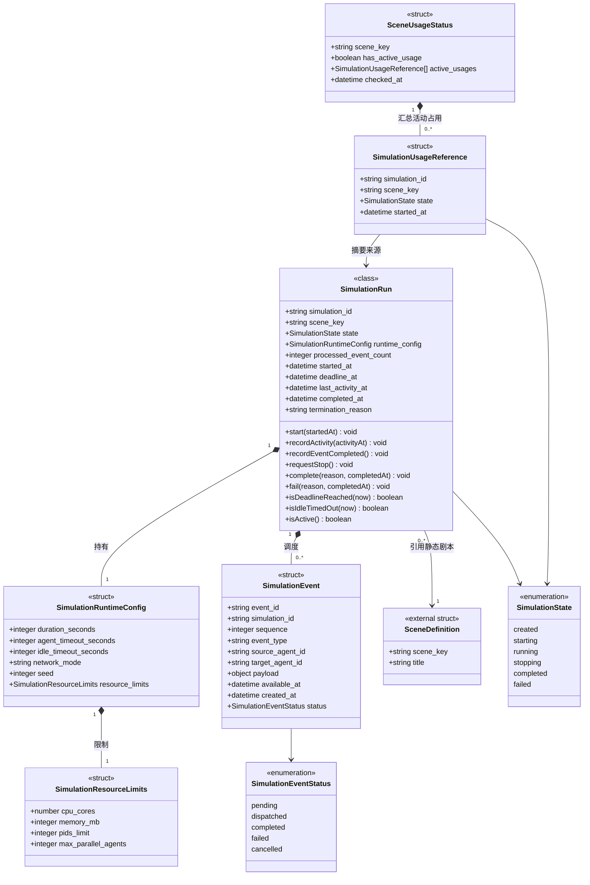

# 仿真编排与容器运行时设计

> 状态：目标设计。本文定义持续时间约束、事件到达即调度的仿真运行模型。当前代码中的固定循环计数调度属于待迁移实现，不构成目标设计合同。

## 1. 设计目标

编排层负责把静态剧本转换为一次可审计的多 Agent 仿真运行。逻辑 Agent 与容器槽位分离：逻辑身份来自剧本，容器只是可复用的后端执行资源。

核心边界：

- `SceneDefinition` 描述静态剧本内容；
- `SimulationRun` 描述一次仿真实例；
- `SimulationRuntimeConfig` 描述该仿真实例的持续时间、执行超时和资源限制；
- `SimulationEvent` 描述仿真期间待处理或已处理的调度事件；
- `SimulationUsageReference` 和 `SceneUsageStatus` 描述剧本的运行占用情况；
- 剧本加载、查询和预览不得修改仿真运行配置、事件队列或运行状态；
- 仿真运行数据模型只在本领域定义，不放入剧本管理数据模型。

## 2. 仿真领域模型

### 2.1 仿真运行类 `SimulationRun`

| 字段 | 类型 | 必填 | 描述 |
|---|---|---:|---|
| `simulation_id` | string | 是 | 仿真实例唯一标识。 |
| `scene_key` | string | 是 | 本次仿真引用的剧本标识。 |
| `state` | `SimulationState` | 是 | 仿真实例状态。 |
| `runtime_config` | `SimulationRuntimeConfig` | 是 | 本次仿真的运行参数。 |
| `processed_event_count` | integer | 是 | 已完成处理的调度事件数量。 |
| `started_at` | datetime | 否 | 启动时间。 |
| `deadline_at` | datetime | 否 | 根据持续时间计算的强制截止时间。 |
| `last_activity_at` | datetime | 否 | 最近一次有效事件入队、派发或完成时间。 |
| `completed_at` | datetime | 否 | 完成时间。 |
| `termination_reason` | string | 否 | 终止原因。 |

领域函数：

| 函数 | 返回类型 | 职责 |
|---|---|---|
| `start(startedAt)` | void | 进入 `running` 状态，记录开始时间并计算截止时间。 |
| `recordActivity(activityAt)` | void | 更新最近活动时间。 |
| `recordEventCompleted()` | void | 已处理事件数量加一。 |
| `requestStop()` | void | 进入 `stopping` 状态。 |
| `complete(reason, completedAt)` | void | 进入 `completed` 状态并记录原因。 |
| `fail(reason, completedAt)` | void | 进入 `failed` 状态并记录原因。 |
| `isDeadlineReached(now)` | boolean | 判断是否达到仿真持续时间上限。 |
| `isIdleTimedOut(now)` | boolean | 判断空闲时间是否达到终止阈值。 |
| `isActive()` | boolean | 判断是否仍占用剧本和运行资源。 |

### 2.2 仿真运行配置结构体 `SimulationRuntimeConfig`

| 字段 | 类型 | 必填 | 描述 |
|---|---|---:|---|
| `duration_seconds` | integer | 是 | 本次仿真的最大墙钟持续时间。 |
| `agent_timeout_seconds` | integer | 是 | 单次 Agent 事件处理的最长执行时间。 |
| `idle_timeout_seconds` | integer | 是 | 无待处理事件且无执行中任务时允许等待新事件的最长时间。 |
| `network_mode` | string | 是 | 网络通信与仿真模式，当前为 `a2a`。 |
| `seed` | integer | 是 | 本次仿真的随机种子。 |
| `resource_limits` | `SimulationResourceLimits` | 是 | 本次仿真的系统资源限制。 |

所有字段由仿真创建请求确定，并在启动前完成校验。它们不属于 `SceneDefinition`，也不由剧本列表或详情接口返回。

### 2.3 系统资源限制结构体 `SimulationResourceLimits`

| 字段 | 类型 | 必填 | 描述 |
|---|---|---:|---|
| `cpu_cores` | number | 是 | 本次仿真允许使用的 CPU 核数上限。 |
| `memory_mb` | integer | 是 | 本次仿真允许使用的内存上限。 |
| `pids_limit` | integer | 否 | 本次仿真允许创建的进程数量上限。 |
| `max_parallel_agents` | integer | 是 | 同时执行 Agent 任务的最大数量。 |

资源限制由仿真管理模块校验，由容量管理模块预留，并由容器运行时落实到容器配置和任务执行并发度。资源不足或限制无法应用时不得启动仿真。

### 2.4 调度事件结构体 `SimulationEvent`

| 字段 | 类型 | 必填 | 描述 |
|---|---|---:|---|
| `event_id` | string | 是 | 事件唯一标识。 |
| `simulation_id` | string | 是 | 所属仿真实例。 |
| `sequence` | integer | 是 | 同一仿真内单调递增的稳定排序号。 |
| `event_type` | string | 是 | 任务、消息、系统事件或其他调度事件类型。 |
| `source_agent_id` | string | 否 | 事件来源逻辑 Agent。 |
| `target_agent_id` | string | 否 | 事件目标逻辑 Agent。 |
| `payload` | object | 是 | 事件载荷。 |
| `available_at` | datetime | 是 | 事件允许被派发的时间。 |
| `created_at` | datetime | 是 | 事件创建时间。 |
| `status` | `SimulationEventStatus` | 是 | 事件处理状态。 |

事件队列按 `available_at`、`sequence` 稳定排序。同一逻辑 Agent 默认只允许一个事件处理任务处于执行中；不同 Agent 可以在资源限制范围内并行执行。

### 2.5 仿真运行引用结构体 `SimulationUsageReference`

表示一个仍占用剧本资源的仿真实例摘要，仅供仿真管理模块内部管理和占用查询接口构造结果。

| 字段 | 类型 | 必填 | 描述 |
|---|---|---:|---|
| `simulation_id` | string | 是 | 仿真实例唯一标识。 |
| `scene_key` | string | 是 | 仿真引用的剧本标识。 |
| `state` | `SimulationState` | 是 | 当前仿真状态。 |
| `started_at` | datetime | 否 | 仿真开始时间。 |

只有 `starting`、`running`、`stopping` 状态的仿真形成活动占用。

### 2.6 剧本占用状态结构体 `SceneUsageStatus`

| 字段 | 类型 | 必填 | 描述 |
|---|---|---:|---|
| `scene_key` | string | 是 | 被检查的剧本标识。 |
| `has_active_usage` | boolean | 是 | 是否至少存在一个活动仿真实例引用该剧本。 |
| `active_usages` | `SimulationUsageReference[]` | 是 | 活动运行引用集合。当前并发上限为 `1` 时基数为 `0..1`，未来可为 `0..*`。 |
| `checked_at` | datetime | 是 | 占用检查时间。 |

计算规则：

```text
has_active_usage = active_usages.length > 0
```

对剧本管理模块的 `IF-SIM-01` 默认只需返回 `has_active_usage`。运行引用详情属于仿真领域，可按管理、审计或诊断需求通过独立仿真接口提供，不应复制到剧本领域模型。

### 2.7 状态枚举

`SimulationState`：

- `created`
- `starting`
- `running`
- `stopping`
- `completed`
- `failed`

`SimulationEventStatus`：

- `pending`
- `dispatched`
- `completed`
- `failed`
- `cancelled`

### 2.8 模型关系



## 3. 当前并发限制与扩展边界

当前实现同一时间最多允许一个仿真处于启动、运行或停止阶段：

```text
max_concurrent_simulations = 1
```

当前代码使用单一全局状态表达仿真。该状态属于待迁移实现，不能作为永久外部合同。

当前约束：

1. 新仿真开始前必须确认运行数量小于并发上限；
2. 当前上限为 `1`，运行期间不得启动第二个仿真；
3. 停止、失败或正常结束后必须释放运行状态；
4. 同一仿真内部的不同 Agent 可以在资源限制范围内并行执行，但不代表多个仿真实例并发运行。

“当前只运行一个仿真”是运行策略，不是永久领域约束。未来提高并发上限时，应：

1. 使用 `simulation_id` 标识每个仿真实例；
2. 将单一全局状态替换为按 `simulation_id` 索引的运行注册表；
3. 每个仿真实例独立保存运行配置、事件队列、Agent 注册表、容器分配、通信矩阵和终止状态；
4. 每个仿真实例独立拥有日志 session、PCAP、manifest、网络 profile 和清理流程；
5. 状态查询、停止、日志查询和结果下载接口能够指定 `simulation_id`；
6. 剧本占用查询从运行注册表筛选相同 `scene_key` 的活动实例；
7. 并发上限由配置或容量策略控制，默认仍可为 `1`。

## 4. 剧本加载契约

控制面读取静态剧本资源：

```text
scenes/<scene>/
  meta_and_roles.json
  instances_and_skills.json
  network_topology.json
  skills/
  tools.py 或其他 Tool 注册资源
```

加载器负责：

- 解析剧本基本信息；
- 解析 Agent 定义；
- 分别构造 Skill 定义集合和 Tool 定义集合；
- 校验 Agent 的 Skill 引用和 Tool 授权；
- 校验通信拓扑及网络参数；
- 返回无运行副作用的 `SceneDefinition`。

加载器不得：

- 修改 `SimulationRuntimeConfig`；
- 修改事件队列、调度进度或终止状态；
- 设置当前运行剧本；
- 注册 Agent 或分配容器；
- 因读取剧本而改变全局仿真状态。

## 5. 仿真创建与启动

仿真创建输入至少包括：

```text
scene_key
runtime_config.duration_seconds
runtime_config.agent_timeout_seconds
runtime_config.idle_timeout_seconds
runtime_config.network_mode
runtime_config.seed
runtime_config.resource_limits
```

启动阶段：

1. 校验并发容量；
2. 读取并校验静态剧本；
3. 校验 `SimulationRuntimeConfig` 和资源限制；
4. 创建 `simulation_id` 和 `SimulationRun`；
5. 预留系统资源；
6. 重置并分配容器，并应用 CPU、内存、进程数等限制；
7. 构造 Agent 目录和通信矩阵；
8. 创建本次仿真的事件队列并写入初始任务事件；
9. 启动日志 session；
10. 创建 experiment manifest，记录 `event_driven` 调度模式、持续时间配置和资源限制；
11. 配置网络 profile；
12. 启动所有 Agent 的 PCAP；
13. 检查启动完整性；
14. 将仿真状态置为 `running` 并启动事件调度器。

资源无法预留、资源限制无法应用、已请求的网络仿真无法配置，或任一 Agent 抓包无法启动时，仿真不得继续运行。

## 6. 剧本占用查询接口

`IF-SIM-01 查询剧本占用状态` 由仿真管理模块提供。

输入：

```text
scene_key
```

面向剧本管理模块的最小输出：

```text
has_active_usage: boolean
```

仿真管理模块内部可以同时构造完整的 `SceneUsageStatus`，但不得要求剧本管理模块持有 `SimulationRun` 或 `SimulationUsageReference`。

查询规则：

1. 从运行注册表筛选 `scene_key` 相同的仿真实例；
2. 仅保留 `starting`、`running`、`stopping` 状态；
3. 集合非空时 `has_active_usage=true`；
4. 查询失败时不得默认返回“无占用”，应阻止删除并返回占用检查失败。

## 7. 容器分配与资源限制

`ContainerRuntime` 按后端选择镜像：

| 后端 | 镜像 | 默认容器前缀 |
|---|---|---|
| Claude Code | `agentnetwork-ag-c1` | `ag-c` |
| OpenCLAW | `agentnetwork-ag-o1` | `ag-o` |

分配顺序：

1. 复用同后端且未被本次仿真占用的运行容器；
2. 无可用槽位且 Docker SDK 可用时动态创建容器；
3. 动态容器加入 `an` 网络，挂载代码、只读 scenes 和可写 PCAP 目录，并授予 `NET_RAW`、`NET_ADMIN`；
4. 对复用或新建容器应用本次仿真的 CPU、内存和进程数限制；
5. 根据 `max_parallel_agents` 限制同时执行的 Agent 任务数量；
6. 无法分配或无法应用限制时记录 assignment error，并以 `assignment_failed` 结束仿真。

容器名不是逻辑 Agent ID。业务日志必须使用运行上下文中的逻辑 `agent_id`。

## 8. 事件驱动调度

目标调度模式固定为 `event_driven`：

1. 启动时把剧本中各 Agent 的初始任务转换为 `SimulationEvent` 并写入事件队列；
2. 调度器阻塞等待可执行事件，不使用固定时间片或周期性空转；
3. 事件到达且目标 Agent 可用时立即派发；
4. 同一逻辑 Agent 默认单任务串行，不同 Agent 可在 `max_parallel_agents` 和系统资源限制内并行；
5. Agent 返回的消息、后续任务或系统事件转换为新的 `SimulationEvent`；
6. 每次事件入队、派发或完成都更新 `last_activity_at`；
7. 事件执行超过 `agent_timeout_seconds` 时标记该事件失败，并按失败策略决定是否继续；
8. 每次事件完成后检查抓包健康、资源使用、用户停止请求、截止时间和空闲终止条件。

`AgentContext` 是后端无关输入合同，`AgentRunResult` 是后端无关输出合同。上下文只携带逻辑身份、任务、消息、权限、状态快照、trace、seed、目录和通信矩阵，不携带调度循环编号或 tick。

### 8.1 外部任务下发与回调

运行中的仿真可通过 `/api/simulations/{simulation_id}/agents/{agent_id}/tasks` 向一个精确 Agent ID 下发 A2A 执行任务。编排器以 `srv` 身份委托统一 `CommManager`，在 `data/tasks/orchestrator.db` 保存出站任务，并登记仿真专用 callback URL 与 token。

Agent Server 把任务持久化为 `SUBMITTED`，`/status.pending_tasks` 使调度器能够唤醒它；无显式 task 的 `/run` 领取最早任务。目标回调 `WORKING`、Artifact 与终态，编排器验证仿真 ID、Task ID 和 token 后更新任务。查询、列表和取消均按 `simulation_id` 隔离。具体合同与防回退规则见 ADR-025。

事件处理的失败隔离规则：

- 单个事件失败不得破坏其他已排队事件；
- 同一 Agent 的后续事件是否继续，由明确的 Agent 失败策略决定；
- 全部 Agent 不可用或关键组件失败时，仿真进入失败收尾；
- 取消仿真时，待处理事件标记为 `cancelled`，执行中任务进入受控停止流程。

## 9. 终止条件

仿真可能因以下原因停止：

- 达到 `runtime_config.duration_seconds`：`duration_elapsed`；
- 用户请求停止：`user_stopped`；
- 事件队列为空、无执行中任务且达到 `runtime_config.idle_timeout_seconds`：`idle_completed`；
- 所有任务完成且系统确认不会再产生新事件：`tasks_completed`；
- 全部 Agent 执行失败：`all_agents_failed`；
- CPU、内存或进程限制触发：`resource_limit_exceeded`；
- 抓包中途停止：`capture_incomplete`；
- 运行时异常：`runtime_exception`；
- 启动阶段资源分配、网络仿真或抓包失败。

仿真持续时间是强制上限。即使仍有待处理事件，达到截止时间后也必须进入停止和收尾流程。

## 10. 收尾与实验状态

任何退出路径都必须执行：

1. 停止接收和派发新事件；
2. 取消待处理事件并等待或终止执行中任务；
3. 停止所有 Agent 抓包；
4. 清理所有 Agent 的 `tc` 配置；
5. 将容器状态恢复为 `idle`，并清除本次仿真的资源限制和运行上下文；
6. 完成 experiment manifest，记录持续时间、已处理事件数、停止原因和资源结果；
7. 执行 `audit_session`；
8. 完成或失败当前 `SimulationRun`；
9. 释放并发容量和预留的系统资源。

只有没有运行时错误、没有抓包不完整、资源清理成功且抓包停止成功时，实验状态才为 `complete`。

## 11. 当前实现差距与迁移要求

当前代码仍包含以下待迁移实现：

- 仿真准备请求只显式接收剧本和随机种子；
- 剧本加载器读取场景中的旧调度计数字段并修改全局终止配置；
- 控制面使用全局执行进度和固定次数循环驱动 Agent；
- Agent 上下文、Dashboard、日志或 manifest 中仍可能包含 `round`、`tick`、`max_rounds`、`stalemate_rounds`、`current_turn`、`current_max_rounds` 等旧字段；
- 动态容器创建尚未落实每次仿真的 CPU、内存和进程数限制；
- experiment manifest 仍记录旧调度模式和执行计数。

代码迁移必须一次性完成：

1. 仿真创建请求显式接收并校验新的 `SimulationRuntimeConfig`；
2. 引入按 `simulation_id` 隔离的事件队列、稳定排序号和事件调度器；
3. 删除固定次数循环和所有旧调度计数字段的生产者、消费者、Dashboard 展示与测试；
4. 将初始任务、Agent 消息和系统触发统一转换为 `SimulationEvent`；
5. 在容器分配和执行器中落实 `SimulationResourceLimits`；
6. 升级 experiment manifest 版本并记录持续时间、资源限制和事件统计；
7. 更新 API、日志、质量审计和端到端测试；
8. 不保留从剧本元数据或旧请求字段隐式生成新运行配置的兼容分支。
