# 剧本管理数据模型

> 状态：设计阶段。本文定义剧本管理领域中的类、结构体和枚举。模型名称表达设计职责，不要求直接映射为同名代码类型或数据库表。

## 1. 模型边界

- **类**：具有独立标识、生命周期或业务行为，类图中同时列出字段和领域函数；
- **结构体**：只承载定义、请求或结果数据，不定义有副作用的业务函数；
- **枚举**：表达有限且稳定的状态和值域；
- 当前阶段采用文件目录扫描和按需解析，不引入数据库表；
- `storage_locator`、`module_locator` 等定位信息只供内部模块使用，不向 Web 前端暴露物理路径；
- 剧本查询不提供排序能力，只支持过滤和分页；
- 当前并发仿真上限为 `1`，但剧本占用状态使用运行引用集合表达，未来可扩展为多个并行仿真；
- Skill 与 Tool 必须在 `SceneDefinition` 中分别存储和校验；
- **仿真运行配置不属于剧本**。`SceneDefinition` 和 `ScenePreview` 不保存 `max_rounds`、`stalemate_rounds`、`network_mode`、`seed` 等运行参数。

仿真运行配置由 `SimulationRuntimeConfig` 表达，并归属于仿真运行实例，详见《仿真编排与容器运行时设计》。

## 2. 模型添加顺序

1. SR-SCENE-01 上传剧本；
2. SR-SCENE-02 下载剧本；
3. SR-SCENE-03 删除剧本；
4. SR-SCENE-04 预览剧本；
5. SR-SCENE-05 查询剧本。

## 3. SR-SCENE-01 上传剧本模型

### 3.1 剧本资源类 `SceneResource`

| 字段 | 类型 | 必填 | 描述 |
|---|---|---:|---|
| `scene_key` | string | 是 | 剧本唯一标识，当前对应剧本目录名称。 |
| `title` | string | 是 | 剧本展示名称，缺失时回退为 `scene_key`。 |
| `format` | `SceneResourceFormat` | 是 | 剧本资源组织形式。 |
| `resource_status` | `SceneResourceStatus` | 是 | 剧本资源生命周期状态。 |
| `validation_status` | `ValidationStatus` | 是 | 最近一次校验状态。 |
| `storage_locator` | string | 是 | 文件存储模块内部逻辑定位信息。 |
| `entry_files` | string[] | 是 | 剧本主要定义资源列表。 |
| `file_count` | integer | 否 | 剧本包含的文件数量。 |
| `total_size_bytes` | integer | 否 | 剧本资源总大小。 |
| `created_at` | datetime | 否 | 首次进入平台的时间。 |
| `updated_at` | datetime | 否 | 最近修改时间。 |

领域函数：

| 函数 | 返回类型 | 职责 |
|---|---|---|
| `markTemporary(storageLocator, entryFiles)` | void | 记录临时存储结果并进入 `temporary` 状态。 |
| `applyValidation(result)` | void | 应用校验结果并更新校验状态。 |
| `markPersisted(storageLocator)` | void | 正式持久化成功后进入 `persisted` 状态。 |
| `canDelete(usageStatus)` | boolean | 根据剧本占用状态判断是否允许物理删除。 |
| `markDeleting()` | void | 删除开始前进入 `deleting` 状态。 |
| `markDeleted()` | void | 物理删除完成后进入 `deleted` 状态。 |
| `touch(updatedAt)` | void | 更新最近修改时间。 |

### 3.2 剧本定义结构体 `SceneDefinition`

`SceneDefinition` 只描述静态剧本内容。

| 字段 | 类型 | 必填 | 当前或目标来源 |
|---|---|---:|---|
| `scene_key` | string | 是 | 剧本目录名称。 |
| `title` | string | 是 | `scenario_metadata.title`。 |
| `description` | string | 否 | 剧本背景、全局规则或说明。 |
| `agents` | `AgentDefinition[]` | 是 | `roles` 与 `container_instances`。 |
| `skills` | `SkillDefinition[]` | 是 | 当前剧本 Skill 资源扫描和解析结果。 |
| `tools` | `ToolDefinition[]` | 是 | 当前剧本 Tool 注册资源扫描和解析结果。 |
| `topology` | `CommunicationRelation[]` | 是 | 剧本通信拓扑定义。 |

约束：

- `skills` 保存剧本中可被引用的全部 Skill 定义；
- `tools` 保存剧本中可被授权执行的全部 Tool 定义；
- `AgentDefinition.skill_refs` 只能引用 `skills` 中存在的 `skill_ref`；
- `AgentDefinition.allowed_tools` 只能引用 `tools` 中存在的 `tool_ref`；
- Skill 源文件读取权限与 Tool 执行权限必须分别校验；
- 不得在 `SceneDefinition` 中增加仿真轮数、终止阈值、随机种子或运行模式字段。

### 3.3 Agent 定义结构体 `AgentDefinition`

| 字段 | 类型 | 必填 | 当前来源 |
|---|---|---:|---|
| `agent_id` | string | 是 | 角色映射键标准化后得到。 |
| `name` | string | 是 | `roles.<role_id>.name`。 |
| `role` | string | 是 | 优先使用 `roles.<role_id>.identity`。 |
| `background` | string | 否 | Agent 背景说明。 |
| `core_goal` | string | 否 | `roles.<role_id>.core_goal`。 |
| `backend` | `BackendType` | 是 | `roles.<role_id>.model_backbone`。 |
| `skill_refs` | string[] | 是 | 引用 `SceneDefinition.skills`。 |
| `allowed_tools` | string[] | 是 | 引用 `SceneDefinition.tools`。 |
| `tasks` | string[] | 是 | Agent 初始任务定义。 |

### 3.4 Skill 定义结构体 `SkillDefinition`

| 字段 | 类型 | 必填 | 描述 |
|---|---|---:|---|
| `skill_ref` | string | 是 | 剧本内唯一 Skill 标识，也是 Agent 引用值。 |
| `name` | string | 否 | Skill 展示名称。 |
| `description` | string | 否 | Skill 功能说明。 |
| `entrypoint` | string | 是 | Skill 入口资源，例如包内 `SKILL.md`。 |
| `storage_locator` | string | 是 | Skill 源资源的内部逻辑定位信息。 |
| `available` | boolean | 是 | 入口及关联资源是否可读取。 |

### 3.5 Tool 定义结构体 `ToolDefinition`

| 字段 | 类型 | 必填 | 描述 |
|---|---|---:|---|
| `tool_ref` | string | 是 | 剧本内唯一 Tool 标识，也是 Agent 授权引用值。 |
| `name` | string | 否 | Tool 展示名称。 |
| `description` | string | 否 | Tool 功能说明。 |
| `module_locator` | string | 是 | Tool 注册模块或实现资源的内部逻辑定位信息。 |
| `executable` | boolean | 是 | Tool 是否成功注册并可执行。 |

### 3.6 通信关系结构体 `CommunicationRelation`

| 字段 | 类型 | 必填 | 描述 |
|---|---|---:|---|
| `endpoint_a` | string | 是 | 通信关系一端的 Agent 标识。 |
| `endpoint_b` | string | 是 | 通信关系另一端的 Agent 标识。 |
| `channel_id` | string | 是 | 剧本内唯一通道标识。 |
| `delay_ms` | number | 是 | 固定时延，单位毫秒。 |
| `jitter_ms` | number | 是 | 网络抖动，单位毫秒。 |
| `loss_pct` | number | 是 | 丢包率百分比。 |
| `rate_mbit` | number | 是 | 带宽上限，`0` 表示不限制。 |

### 3.7 校验结果结构体 `ValidationResult`

| 字段 | 类型 | 必填 | 描述 |
|---|---|---:|---|
| `scene_key` | string | 否 | 能识别剧本标识时填写。 |
| `passed` | boolean | 是 | 是否通过校验。 |
| `status` | `ValidationStatus` | 是 | 校验状态。 |
| `checked_at` | datetime | 是 | 校验完成时间。 |
| `errors` | `ValidationIssue[]` | 是 | 阻止持久化或预览的错误。 |
| `warnings` | `ValidationIssue[]` | 是 | 不阻止处理但需要展示的问题。 |

### 3.8 校验问题结构体 `ValidationIssue`

| 字段 | 类型 | 必填 | 描述 |
|---|---|---:|---|
| `issue_code` | string | 是 | 稳定的问题分类编码。 |
| `severity` | `ValidationIssueSeverity` | 是 | 错误或警告。 |
| `field_path` | string | 否 | 对应逻辑字段路径。 |
| `message` | string | 是 | 问题说明。 |
| `related_resource` | string | 否 | 相关 Agent、Skill、Tool、文件或通道标识。 |

剧本校验只校验静态剧本内容，不校验仿真运行轮数、终止阈值或随机种子。

### 3.9 批量处理任务类 `BatchSceneOperation`

| 字段 | 类型 | 必填 | 描述 |
|---|---|---:|---|
| `batch_id` | string | 是 | 批量任务唯一标识。 |
| `operation_type` | `BatchOperationType` | 是 | 上传、下载或删除。 |
| `status` | `BatchOperationStatus` | 是 | 批量任务整体状态。 |
| `requested_count` | integer | 是 | 请求项总数。 |
| `success_count` | integer | 是 | 成功项数量。 |
| `failure_count` | integer | 是 | 失败项数量。 |
| `started_at` | datetime | 是 | 开始处理时间。 |
| `completed_at` | datetime | 否 | 完成时间。 |
| `items` | `BatchSceneItemResult[]` | 是 | 每个剧本的独立处理结果。 |

领域函数：

- `start(startedAt)`；
- `appendResult(result)`；
- `recalculateSummary()`；
- `complete(completedAt)`；
- `markFailed(completedAt)`；
- `hasPartialFailure()`；
- `isFinished()`。

### 3.10 批量项结果结构体 `BatchSceneItemResult`

| 字段 | 类型 | 必填 | 描述 |
|---|---|---:|---|
| `item_index` | integer | 是 | 原始请求中的顺序。 |
| `source_name` | string | 否 | 上传时的原始资源名称。 |
| `scene_key` | string | 否 | 已识别或请求指定的剧本标识。 |
| `status` | `BatchItemStatus` | 是 | 成功或失败。 |
| `error_code` | string | 否 | 失败分类编码。 |
| `error_message` | string | 否 | 失败说明。 |
| `output_locator` | string | 否 | 成功结果的受控逻辑定位信息。 |

## 4. SR-SCENE-02 下载剧本模型

### 4.1 归档资源类 `SceneArchive`

| 字段 | 类型 | 必填 | 描述 |
|---|---|---:|---|
| `archive_id` | string | 是 | 归档资源唯一标识。 |
| `archive_name` | string | 是 | 用户下载时看到的归档名称。 |
| `status` | `ArchiveStatus` | 是 | 归档构建状态。 |
| `included_scene_keys` | string[] | 是 | 已加入归档的剧本标识。 |
| `omitted_scene_keys` | string[] | 是 | 未加入归档的剧本标识。 |
| `included_count` | integer | 是 | 归档中的剧本数量。 |
| `omitted_count` | integer | 是 | 未归档的剧本数量。 |
| `size_bytes` | integer | 否 | 归档资源大小。 |
| `storage_locator` | string | 否 | 归档资源内部定位信息。 |
| `created_at` | datetime | 否 | 归档生成时间。 |
| `expires_at` | datetime | 否 | 临时归档清理时间。 |

领域函数：

- `startBuilding()`；
- `includeScene(sceneKey)`；
- `omitScene(sceneKey)`；
- `markReady(storageLocator, sizeBytes, createdAt)`；
- `markFailed()`；
- `isDownloadable()`；
- `isExpired(now)`。

## 5. SR-SCENE-03 删除剧本模型

### 5.1 仿真占用引用结构体 `SimulationUsageReference`

| 字段 | 类型 | 必填 | 描述 |
|---|---|---:|---|
| `simulation_id` | string | 是 | 仿真运行唯一标识。 |
| `scene_key` | string | 是 | 仿真使用的剧本标识。 |
| `state` | `SimulationUsageState` | 是 | 与剧本占用相关的运行状态。 |
| `started_at` | datetime | 否 | 仿真开始时间。 |

### 5.2 剧本占用状态结构体 `SceneUsageStatus`

| 字段 | 类型 | 必填 | 描述 |
|---|---|---:|---|
| `scene_key` | string | 是 | 被检查的剧本标识。 |
| `occupied` | boolean | 是 | 是否至少有一个运行引用依赖该剧本。 |
| `active_usages` | `SimulationUsageReference[]` | 是 | 运行引用集合；当前基数 `0..1`，未来可为 `0..*`。 |
| `checked_at` | datetime | 是 | 占用检查时间。 |
| `reason` | string | 否 | 不允许删除或判断异常时的说明。 |

`occupied = active_usages.length > 0`。

## 6. SR-SCENE-04 预览剧本模型

### 6.1 剧本预览结构体 `ScenePreview`

| 字段 | 类型 | 必填 | 描述 |
|---|---|---:|---|
| `summary` | `SceneSummary` | 是 | 剧本摘要。 |
| `agents` | `AgentDefinition[]` | 是 | Agent 详细信息。 |
| `skills` | `SkillDefinition[]` | 是 | Skill 定义列表。 |
| `tools` | `ToolDefinition[]` | 是 | Tool 定义列表。 |
| `topology` | `CommunicationRelation[]` | 是 | 通信拓扑。 |
| `validation` | `ValidationResult` | 否 | 本次只读解析附带的校验结果。 |

预览不得：

- 返回或修改仿真运行配置；
- 注册 Agent；
- 分配容器；
- 切换当前仿真；
- 修改仿真运行状态。

## 7. SR-SCENE-05 查询剧本模型

### 7.1 剧本查询条件结构体 `SceneQuery`

| 字段 | 类型 | 必填 | 描述 |
|---|---|---:|---|
| `keyword` | string | 否 | 按剧本标识或标题过滤。 |
| `resource_status` | `SceneResourceStatus` | 否 | 按资源状态过滤。 |
| `validation_status` | `ValidationStatus` | 否 | 按校验状态过滤。 |
| `offset` | integer | 否 | 起始位置。 |
| `limit` | integer | 否 | 最大返回数量。 |

### 7.2 剧本摘要结构体 `SceneSummary`

| 字段 | 类型 | 必填 | 描述 |
|---|---|---:|---|
| `scene_key` | string | 是 | 剧本唯一标识。 |
| `title` | string | 是 | 剧本展示名称。 |
| `description` | string | 否 | 剧本简要说明。 |
| `format` | `SceneResourceFormat` | 是 | 剧本资源格式。 |
| `resource_status` | `SceneResourceStatus` | 是 | 当前资源状态。 |
| `validation_status` | `ValidationStatus` | 是 | 最近校验状态。 |
| `agent_count` | integer | 是 | Agent 数量。 |
| `skill_count` | integer | 是 | Skill 定义数量。 |
| `tool_count` | integer | 是 | Tool 定义数量。 |
| `connection_count` | integer | 是 | 通信关系数量。 |
| `total_size_bytes` | integer | 否 | 剧本总大小。 |
| `updated_at` | datetime | 否 | 最近修改时间。 |

## 8. 枚举

### 8.1 `SceneResourceFormat`

- `folder`

### 8.2 `SceneResourceStatus`

- `temporary`
- `persisted`
- `deleting`
- `deleted`
- `invalid`

### 8.3 `ValidationStatus`

- `unknown`
- `valid`
- `invalid`

### 8.4 `BackendType`

- `openclaw`
- `claude-code`

### 8.5 `ValidationIssueSeverity`

- `error`
- `warning`

### 8.6 `BatchOperationType`

- `upload`
- `download`
- `delete`

### 8.7 `BatchOperationStatus`

- `processing`
- `completed`
- `failed`

### 8.8 `BatchItemStatus`

- `success`
- `failed`

### 8.9 `ArchiveStatus`

- `building`
- `ready`
- `failed`

### 8.10 `SimulationUsageState`

- `starting`
- `running`
- `stopping`

## 9. Mermaid 数据模型图

```mermaid
classDiagram
    %% SR-SCENE-01：上传剧本
    class SceneResource {
        <<class>>
        +string scene_key
        +string title
        +SceneResourceFormat format
        +SceneResourceStatus resource_status
        +ValidationStatus validation_status
        +string storage_locator
        +string[] entry_files
        +integer file_count
        +integer total_size_bytes
        +datetime created_at
        +datetime updated_at
        +markTemporary(storageLocator, entryFiles) void
        +applyValidation(result) void
        +markPersisted(storageLocator) void
        +canDelete(usageStatus) boolean
        +markDeleting() void
        +markDeleted() void
        +touch(updatedAt) void
    }

    class SceneDefinition {
        <<struct>>
        +string scene_key
        +string title
        +string description
        +AgentDefinition[] agents
        +SkillDefinition[] skills
        +ToolDefinition[] tools
        +CommunicationRelation[] topology
    }

    class AgentDefinition {
        <<struct>>
        +string agent_id
        +string name
        +string role
        +string background
        +string core_goal
        +BackendType backend
        +string[] skill_refs
        +string[] allowed_tools
        +string[] tasks
    }

    class SkillDefinition {
        <<struct>>
        +string skill_ref
        +string name
        +string description
        +string entrypoint
        +string storage_locator
        +boolean available
    }

    class ToolDefinition {
        <<struct>>
        +string tool_ref
        +string name
        +string description
        +string module_locator
        +boolean executable
    }

    class CommunicationRelation {
        <<struct>>
        +string endpoint_a
        +string endpoint_b
        +string channel_id
        +number delay_ms
        +number jitter_ms
        +number loss_pct
        +number rate_mbit
    }

    class ValidationResult {
        <<struct>>
        +string scene_key
        +boolean passed
        +ValidationStatus status
        +datetime checked_at
        +ValidationIssue[] errors
        +ValidationIssue[] warnings
    }

    class ValidationIssue {
        <<struct>>
        +string issue_code
        +ValidationIssueSeverity severity
        +string field_path
        +string message
        +string related_resource
    }

    class BatchSceneOperation {
        <<class>>
        +string batch_id
        +BatchOperationType operation_type
        +BatchOperationStatus status
        +integer requested_count
        +integer success_count
        +integer failure_count
        +datetime started_at
        +datetime completed_at
        +BatchSceneItemResult[] items
        +start(startedAt) void
        +appendResult(result) void
        +recalculateSummary() void
        +complete(completedAt) void
        +markFailed(completedAt) void
        +hasPartialFailure() boolean
        +isFinished() boolean
    }

    class BatchSceneItemResult {
        <<struct>>
        +integer item_index
        +string source_name
        +string scene_key
        +BatchItemStatus status
        +string error_code
        +string error_message
        +string output_locator
    }

    %% SR-SCENE-02：下载剧本
    class SceneArchive {
        <<class>>
        +string archive_id
        +string archive_name
        +ArchiveStatus status
        +string[] included_scene_keys
        +string[] omitted_scene_keys
        +integer included_count
        +integer omitted_count
        +integer size_bytes
        +string storage_locator
        +datetime created_at
        +datetime expires_at
        +startBuilding() void
        +includeScene(sceneKey) void
        +omitScene(sceneKey) void
        +markReady(storageLocator, sizeBytes, createdAt) void
        +markFailed() void
        +isDownloadable() boolean
        +isExpired(now) boolean
    }

    %% SR-SCENE-03：删除剧本
    class SimulationUsageReference {
        <<struct>>
        +string simulation_id
        +string scene_key
        +SimulationUsageState state
        +datetime started_at
    }

    class SceneUsageStatus {
        <<struct>>
        +string scene_key
        +boolean occupied
        +SimulationUsageReference[] active_usages
        +datetime checked_at
        +string reason
    }

    %% SR-SCENE-04：预览剧本
    class ScenePreview {
        <<struct>>
        +SceneSummary summary
        +AgentDefinition[] agents
        +SkillDefinition[] skills
        +ToolDefinition[] tools
        +CommunicationRelation[] topology
        +ValidationResult validation
    }

    %% SR-SCENE-05：查询剧本
    class SceneQuery {
        <<struct>>
        +string keyword
        +SceneResourceStatus resource_status
        +ValidationStatus validation_status
        +integer offset
        +integer limit
    }

    class SceneSummary {
        <<struct>>
        +string scene_key
        +string title
        +string description
        +SceneResourceFormat format
        +SceneResourceStatus resource_status
        +ValidationStatus validation_status
        +integer agent_count
        +integer skill_count
        +integer tool_count
        +integer connection_count
        +integer total_size_bytes
        +datetime updated_at
    }

    class SceneResourceFormat {
        <<enumeration>>
        folder
    }

    class SceneResourceStatus {
        <<enumeration>>
        temporary
        persisted
        deleting
        deleted
        invalid
    }

    class ValidationStatus {
        <<enumeration>>
        unknown
        valid
        invalid
    }

    class BackendType {
        <<enumeration>>
        openclaw
        claude-code
    }

    class ValidationIssueSeverity {
        <<enumeration>>
        error
        warning
    }

    class BatchOperationType {
        <<enumeration>>
        upload
        download
        delete
    }

    class BatchOperationStatus {
        <<enumeration>>
        processing
        completed
        failed
    }

    class BatchItemStatus {
        <<enumeration>>
        success
        failed
    }

    class ArchiveStatus {
        <<enumeration>>
        building
        ready
        failed
    }

    class SimulationUsageState {
        <<enumeration>>
        starting
        running
        stopping
    }

    SceneResource "1" *-- "1" SceneDefinition : 包含
    SceneDefinition "1" *-- "1..*" AgentDefinition : 定义
    SceneDefinition "1" *-- "0..*" SkillDefinition : 存储Skill
    SceneDefinition "1" *-- "0..*" ToolDefinition : 存储Tool
    SceneDefinition "1" *-- "0..*" CommunicationRelation : 定义
    AgentDefinition "1" --> "0..*" SkillDefinition : skill_refs引用
    AgentDefinition "1" --> "0..*" ToolDefinition : allowed_tools引用

    SceneDefinition --> ValidationResult : 校验产生
    ValidationResult "1" *-- "0..*" ValidationIssue : 包含
    BatchSceneOperation "1" *-- "1..*" BatchSceneItemResult : 汇总

    SceneArchive "1" o-- "1..*" SceneResource : 打包

    SceneUsageStatus "1" *-- "0..*" SimulationUsageReference : 包含
    SceneResource --> SceneUsageStatus : 删除前检查

    SceneDefinition --> ScenePreview : 转换
    ScenePreview "1" *-- "1" SceneSummary : 包含
    ScenePreview "1" *-- "1..*" AgentDefinition : 展示
    ScenePreview "1" *-- "0..*" SkillDefinition : 展示Skill
    ScenePreview "1" *-- "0..*" ToolDefinition : 展示Tool
    ScenePreview "1" *-- "0..*" CommunicationRelation : 展示
    ScenePreview "1" o-- "0..1" ValidationResult : 附带

    SceneQuery --> SceneSummary : 查询返回
```

## 10. 当前实现差距

当前代码中的 `SceneDefinition` 已只保存 `scene_key`、`title`、`description`、Agent 和拓扑；Skill 引用与 Tool 授权仍保存在每个 `AgentDef` 中。目标实现还需构造独立的 `skills` 和 `tools` 定义集合。

当前剧本加载流程仍会读取 `scenario_metadata.max_rounds` 和 `scenario_metadata.stalemate_rounds`，并修改全局仿真终止配置。这属于待迁移实现。后续实现应：

1. 从剧本解析结果中移除运行参数；
2. 由仿真创建或启动请求构造 `SimulationRuntimeConfig`；
3. 按 `simulation_id` 保存运行配置；
4. 确保剧本查询与预览不读取或修改仿真运行配置。
