# 剧本管理数据模型

> 状态：设计阶段。本文细化剧本管理领域涉及的类、结构体和枚举。模型名称用于表达设计职责，不要求直接映射为同名代码类型或数据库表。

## 1. 模型分类原则

- **类**：具有独立标识、生命周期或业务行为的领域对象。
- **结构体**：只承载一次请求、解析结果、校验结果或展示数据，不独立维护生命周期。
- **枚举**：表达有限且稳定的状态、类型和值域。
- 当前阶段以文件目录扫描和按需解析实现，不引入数据库表。
- `storage_locator` 等定位信息仅供文件存储模块内部使用，不能直接向 Web 前端暴露物理路径。
- 剧本查询不提供排序能力，只支持过滤和分页。
- 当前并发仿真上限为 `1`，但数据模型不得把“单仿真”固化为永久业务约束；剧本占用状态按运行引用集合表达，当前集合基数为 `0..1`，未来可扩展为 `0..*`。

## 2. 模型添加顺序

模型按照对应剧本管理能力进入设计的顺序组织：

1. SR-SCENE-01 上传剧本；
2. SR-SCENE-02 下载剧本；
3. SR-SCENE-03 删除剧本；
4. SR-SCENE-04 预览剧本；
5. SR-SCENE-05 查询剧本。

同一 SR 内先列核心资源，再列组成结构、处理结果和状态枚举。

## 3. SR-SCENE-01 上传剧本模型

### 3.1 剧本资源类 `SceneResource`

| 字段 | 类型 | 必填 | 描述 |
|---|---|---:|---|
| `scene_key` | string | 是 | 剧本唯一标识，当前对应剧本目录名称。 |
| `title` | string | 是 | 剧本展示名称，缺失时回退为 `scene_key`。 |
| `format` | `SceneResourceFormat` | 是 | 剧本资源组织形式，当前为目录型。 |
| `resource_status` | `SceneResourceStatus` | 是 | 剧本资源生命周期状态。 |
| `validation_status` | `ValidationStatus` | 是 | 最近一次合法性校验状态。 |
| `storage_locator` | string | 是 | 文件存储模块内部使用的逻辑定位信息。 |
| `entry_files` | string[] | 是 | 剧本主要定义资源列表。 |
| `file_count` | integer | 否 | 剧本包含的文件数量。 |
| `total_size_bytes` | integer | 否 | 剧本资源总大小。 |
| `created_at` | datetime | 否 | 资源首次进入平台的时间。 |
| `updated_at` | datetime | 否 | 资源最近修改时间。 |

### 3.2 剧本定义结构体 `SceneDefinition`

| 字段 | 类型 | 必填 | 当前来源 |
|---|---|---:|---|
| `scene_key` | string | 是 | 剧本目录名称。 |
| `title` | string | 是 | `scenario_metadata.title`。 |
| `description` | string | 否 | 当前由 `scenario_metadata.global_rules` 映射。 |
| `max_rounds` | integer | 否 | `scenario_metadata.max_rounds`。 |
| `stalemate_rounds` | integer | 否 | `scenario_metadata.stalemate_rounds`。 |
| `agents` | `AgentDefinition[]` | 是 | `roles` 与 `container_instances`。 |
| `topology` | `CommunicationRelation[]` | 是 | 网络拓扑定义。 |

### 3.3 Agent 定义结构体 `AgentDefinition`

| 字段 | 类型 | 必填 | 当前来源 |
|---|---|---:|---|
| `agent_id` | string | 是 | 角色映射键标准化后得到。 |
| `name` | string | 是 | `roles.<role_id>.name`。 |
| `role` | string | 是 | 优先使用 `roles.<role_id>.identity`。 |
| `background` | string | 否 | 数据结构已支持，当前加载流程尚未接入。 |
| `core_goal` | string | 否 | `roles.<role_id>.core_goal`。 |
| `backend` | `BackendType` | 是 | `roles.<role_id>.model_backbone`。 |
| `skill_refs` | string[] | 是 | `container_instances.<role_id>.skill_refs`。 |
| `allowed_tools` | string[] | 是 | `container_instances.<role_id>.tool_refs`。 |
| `tasks` | string[] | 是 | 数据结构已支持，当前加载结果为空列表。 |

### 3.4 能力引用结构体 `CapabilityReference`

| 字段 | 类型 | 必填 | 描述 |
|---|---|---:|---|
| `agent_id` | string | 是 | 引用该能力的 Agent。 |
| `reference_type` | `CapabilityReferenceType` | 是 | Skill 或 Tool。 |
| `reference_name` | string | 是 | 能力名称。 |
| `required` | boolean | 是 | 缺失时是否判定为校验错误，默认 `true`。 |
| `available` | boolean | 否 | 校验阶段得到的资源可用状态。 |

### 3.5 通信关系结构体 `CommunicationRelation`

| 字段 | 类型 | 必填 | 描述 |
|---|---|---:|---|
| `endpoint_a` | string | 是 | 通信关系一端的 Agent 标识。 |
| `endpoint_b` | string | 是 | 通信关系另一端的 Agent 标识。 |
| `channel_id` | string | 是 | 剧本内唯一通道标识。 |
| `delay_ms` | number | 是 | 固定时延，单位毫秒，默认 `0`。 |
| `jitter_ms` | number | 是 | 网络抖动，单位毫秒，默认 `0`。 |
| `loss_pct` | number | 是 | 丢包率百分比，默认 `0`。 |
| `rate_mbit` | number | 是 | 带宽上限，单位 Mbit/s，默认 `0` 表示不限制。 |

### 3.6 校验结果结构体 `ValidationResult`

| 字段 | 类型 | 必填 | 描述 |
|---|---|---:|---|
| `scene_key` | string | 否 | 能够识别剧本标识时填写。 |
| `passed` | boolean | 是 | 是否通过校验。 |
| `status` | `ValidationStatus` | 是 | 校验状态。 |
| `checked_at` | datetime | 是 | 校验完成时间。 |
| `errors` | `ValidationIssue[]` | 是 | 阻止持久化或预览的错误。 |
| `warnings` | `ValidationIssue[]` | 是 | 不阻止处理但需要展示的问题。 |

### 3.7 校验问题结构体 `ValidationIssue`

| 字段 | 类型 | 必填 | 描述 |
|---|---|---:|---|
| `issue_code` | string | 是 | 稳定的问题分类编码。 |
| `severity` | `ValidationIssueSeverity` | 是 | 错误或警告。 |
| `field_path` | string | 否 | 对应的逻辑字段路径。 |
| `message` | string | 是 | 问题说明。 |
| `related_resource` | string | 否 | 相关 Agent、Skill、Tool、文件或通道标识。 |

### 3.8 批量处理任务类 `BatchSceneOperation`

| 字段 | 类型 | 必填 | 描述 |
|---|---|---:|---|
| `batch_id` | string | 是 | 批量任务唯一标识。 |
| `operation_type` | `BatchOperationType` | 是 | 上传、下载或删除。 |
| `status` | `BatchOperationStatus` | 是 | 批量任务整体状态。 |
| `requested_count` | integer | 是 | 请求项总数。 |
| `success_count` | integer | 是 | 成功项数量。 |
| `failure_count` | integer | 是 | 失败项数量。 |
| `started_at` | datetime | 是 | 开始处理时间。 |
| `completed_at` | datetime | 否 | 完成时间。 |
| `items` | `BatchSceneItemResult[]` | 是 | 每个剧本的独立处理结果。 |

### 3.9 批量项结果结构体 `BatchSceneItemResult`

| 字段 | 类型 | 必填 | 描述 |
|---|---|---:|---|
| `item_index` | integer | 是 | 原始请求中的顺序。 |
| `source_name` | string | 否 | 上传时的原始文件或资源名称。 |
| `scene_key` | string | 否 | 已识别或请求指定的剧本标识。 |
| `status` | `BatchItemStatus` | 是 | 成功或失败。 |
| `error_code` | string | 否 | 失败分类编码。 |
| `error_message` | string | 否 | 失败说明。 |
| `output_locator` | string | 否 | 成功结果的受控逻辑定位信息。 |

## 4. SR-SCENE-02 下载剧本模型

### 4.1 归档资源类 `SceneArchive`

| 字段 | 类型 | 必填 | 描述 |
|---|---|---:|---|
| `archive_id` | string | 是 | 归档资源唯一标识。 |
| `archive_name` | string | 是 | 用户下载时看到的归档名称。 |
| `status` | `ArchiveStatus` | 是 | 归档构建状态。 |
| `included_scene_keys` | string[] | 是 | 已加入归档的剧本标识。 |
| `omitted_scene_keys` | string[] | 是 | 因缺失或读取失败未加入归档的剧本标识。 |
| `included_count` | integer | 是 | 归档中的剧本数量。 |
| `omitted_count` | integer | 是 | 未归档的剧本数量。 |
| `size_bytes` | integer | 否 | 归档资源大小。 |
| `storage_locator` | string | 否 | 归档资源内部定位信息。 |
| `created_at` | datetime | 否 | 归档生成时间。 |
| `expires_at` | datetime | 否 | 临时归档的清理时间。 |

## 5. SR-SCENE-03 删除剧本模型

### 5.1 仿真占用引用结构体 `SimulationUsageReference`

表示一个正在依赖剧本资源的仿真运行引用。

| 字段 | 类型 | 必填 | 描述 |
|---|---|---:|---|
| `simulation_id` | string | 是 | 仿真运行唯一标识。 |
| `scene_key` | string | 是 | 仿真使用的剧本标识。 |
| `state` | `SimulationUsageState` | 是 | 与剧本占用相关的运行状态。 |
| `started_at` | datetime | 否 | 仿真开始时间。 |

### 5.2 剧本占用状态结构体 `SceneUsageStatus`

| 字段 | 类型 | 必填 | 描述 |
|---|---|---:|---|
| `scene_key` | string | 是 | 被检查的剧本标识。 |
| `occupied` | boolean | 是 | 是否至少有一个运行引用依赖该剧本。 |
| `active_usages` | `SimulationUsageReference[]` | 是 | 依赖该剧本的运行引用；当前最多一项，未来可返回多项。 |
| `checked_at` | datetime | 是 | 占用检查时间。 |
| `reason` | string | 否 | 不允许删除或判断异常时的说明。 |

占用计算规则：

```text
occupied = active_usages.length > 0
```

当前阶段：

- 并发仿真上限为 `1`，因此 `active_usages` 的基数为 `0..1`；
- 当前没有仿真依赖目标剧本时，允许删除；
- 当前唯一运行仿真使用目标剧本时，阻止删除。

未来扩展：

- 提高并发上限后，`active_usages` 可自然扩展为 `0..*`；
- 删除保护继续使用相同接口，只要集合非空即阻止物理删除；
- 不需要把单值字段迁移成列表，也不需要改变占用判断语义。

## 6. SR-SCENE-04 预览剧本模型

### 6.1 运行配置结构体 `SceneRuntimeConfig`

| 字段 | 类型 | 必填 | 描述 |
|---|---|---:|---|
| `max_rounds` | integer | 否 | 最大运行轮数。 |
| `stalemate_rounds` | integer | 否 | 无进展终止阈值。 |
| `network_mode` | string | 否 | 当前设计为 `direct`。 |

### 6.2 剧本预览结构体 `ScenePreview`

| 字段 | 类型 | 必填 | 描述 |
|---|---|---:|---|
| `summary` | `SceneSummary` | 是 | 剧本摘要。 |
| `runtime_config` | `SceneRuntimeConfig` | 是 | 运行配置摘要。 |
| `agents` | `AgentDefinition[]` | 是 | Agent 详细信息。 |
| `capabilities` | `CapabilityReference[]` | 是 | Skill 和 Tool 引用。 |
| `topology` | `CommunicationRelation[]` | 是 | 通信拓扑。 |
| `validation` | `ValidationResult` | 否 | 本次只读解析附带的校验结果。 |

预览不得触发 Agent 注册、容器分配、当前剧本切换或仿真状态修改。

## 7. SR-SCENE-05 查询剧本模型

### 7.1 剧本查询条件结构体 `SceneQuery`

| 字段 | 类型 | 必填 | 描述 |
|---|---|---:|---|
| `keyword` | string | 否 | 按剧本标识或标题过滤。 |
| `resource_status` | `SceneResourceStatus` | 否 | 按资源状态过滤。 |
| `validation_status` | `ValidationStatus` | 否 | 按校验状态过滤。 |
| `offset` | integer | 否 | 起始位置，默认 `0`。 |
| `limit` | integer | 否 | 最大返回数量。 |

### 7.2 剧本摘要结构体 `SceneSummary`

| 字段 | 类型 | 必填 | 描述 |
|---|---|---:|---|
| `scene_key` | string | 是 | 剧本唯一标识。 |
| `title` | string | 是 | 剧本展示名称。 |
| `description` | string | 否 | 剧本简要说明。 |
| `format` | `SceneResourceFormat` | 是 | 当前为目录型。 |
| `resource_status` | `SceneResourceStatus` | 是 | 当前资源状态。 |
| `validation_status` | `ValidationStatus` | 是 | 最近校验状态。 |
| `agent_count` | integer | 是 | Agent 数量。 |
| `skill_count` | integer | 是 | 去重后的 Skill 引用数量。 |
| `tool_count` | integer | 是 | 去重后的 Tool 引用数量。 |
| `connection_count` | integer | 是 | 通信关系数量。 |
| `total_size_bytes` | integer | 否 | 剧本总大小。 |
| `updated_at` | datetime | 否 | 最近修改时间。 |

## 8. 枚举

枚举按照其字段首次出现的顺序列出。

### 8.1 `SceneResourceFormat`

| 值 | 描述 |
|---|---|
| `folder` | 目录型剧本；当前实现形式。 |

### 8.2 `SceneResourceStatus`

| 值 | 描述 |
|---|---|
| `temporary` | 已临时保存，尚未持久化。 |
| `persisted` | 已校验并进入正式存储。 |
| `deleting` | 正在删除。 |
| `deleted` | 已删除，仅用于操作结果表达。 |
| `invalid` | 资源存在但未通过合法性校验。 |

### 8.3 `ValidationStatus`

| 值 | 描述 |
|---|---|
| `unknown` | 尚未校验或无法确认。 |
| `valid` | 校验通过。 |
| `invalid` | 校验失败。 |

### 8.4 `BackendType`

| 值 | 描述 |
|---|---|
| `openclaw` | 使用 OpenCLAW 后端。 |
| `claude-code` | 使用 Claude Code 后端。 |

### 8.5 `CapabilityReferenceType`

| 值 | 描述 |
|---|---|
| `skill` | Skill 源文件能力引用。 |
| `tool` | 可执行原子 Tool 引用。 |

### 8.6 `ValidationIssueSeverity`

| 值 | 描述 |
|---|---|
| `error` | 阻止持久化、预览或后续处理。 |
| `warning` | 允许继续处理，但需要展示。 |

### 8.7 `BatchOperationType`

| 值 | 描述 |
|---|---|
| `upload` | 批量上传。 |
| `download` | 批量下载。 |
| `delete` | 批量删除。 |

### 8.8 `BatchOperationStatus`

| 值 | 描述 |
|---|---|
| `processing` | 正在逐项处理。 |
| `completed` | 已完成逐项处理，允许存在部分失败。 |
| `failed` | 批量请求本身无法解析或无法开始处理。 |

### 8.9 `BatchItemStatus`

| 值 | 描述 |
|---|---|
| `success` | 当前剧本处理成功。 |
| `failed` | 当前剧本处理失败。 |

### 8.10 `ArchiveStatus`

| 值 | 描述 |
|---|---|
| `building` | 正在生成归档。 |
| `ready` | 归档可下载。 |
| `failed` | 归档生成失败。 |

### 8.11 `SimulationUsageState`

| 值 | 描述 |
|---|---|
| `starting` | 仿真正在启动，已经占用剧本运行资源。 |
| `running` | 仿真正在运行。 |
| `stopping` | 仿真正在停止，尚未完全释放剧本运行资源。 |

## 9. Mermaid 类图

```mermaid
classDiagram
    %% SR-SCENE-01：上传剧本
    class SceneResource {
        <<class>>
        +string scene_key
        +string title
        +SceneResourceFormat format
        +SceneResourceStatus resource_status
        +ValidationStatus validation_status
        +string storage_locator
        +string[] entry_files
        +integer file_count
        +integer total_size_bytes
        +datetime created_at
        +datetime updated_at
    }

    class SceneDefinition {
        <<struct>>
        +string scene_key
        +string title
        +string description
        +integer max_rounds
        +integer stalemate_rounds
        +AgentDefinition[] agents
        +CommunicationRelation[] topology
    }

    class AgentDefinition {
        <<struct>>
        +string agent_id
        +string name
        +string role
        +string background
        +string core_goal
        +BackendType backend
        +string[] skill_refs
        +string[] allowed_tools
        +string[] tasks
    }

    class CapabilityReference {
        <<struct>>
        +string agent_id
        +CapabilityReferenceType reference_type
        +string reference_name
        +boolean required
        +boolean available
    }

    class CommunicationRelation {
        <<struct>>
        +string endpoint_a
        +string endpoint_b
        +string channel_id
        +number delay_ms
        +number jitter_ms
        +number loss_pct
        +number rate_mbit
    }

    class ValidationResult {
        <<struct>>
        +string scene_key
        +boolean passed
        +ValidationStatus status
        +datetime checked_at
        +ValidationIssue[] errors
        +ValidationIssue[] warnings
    }

    class ValidationIssue {
        <<struct>>
        +string issue_code
        +ValidationIssueSeverity severity
        +string field_path
        +string message
        +string related_resource
    }

    class BatchSceneOperation {
        <<class>>
        +string batch_id
        +BatchOperationType operation_type
        +BatchOperationStatus status
        +integer requested_count
        +integer success_count
        +integer failure_count
        +datetime started_at
        +datetime completed_at
        +BatchSceneItemResult[] items
    }

    class BatchSceneItemResult {
        <<struct>>
        +integer item_index
        +string source_name
        +string scene_key
        +BatchItemStatus status
        +string error_code
        +string error_message
        +string output_locator
    }

    %% SR-SCENE-02：下载剧本
    class SceneArchive {
        <<class>>
        +string archive_id
        +string archive_name
        +ArchiveStatus status
        +string[] included_scene_keys
        +string[] omitted_scene_keys
        +integer included_count
        +integer omitted_count
        +integer size_bytes
        +string storage_locator
        +datetime created_at
        +datetime expires_at
    }

    %% SR-SCENE-03：删除剧本
    class SimulationUsageReference {
        <<struct>>
        +string simulation_id
        +string scene_key
        +SimulationUsageState state
        +datetime started_at
    }

    class SceneUsageStatus {
        <<struct>>
        +string scene_key
        +boolean occupied
        +SimulationUsageReference[] active_usages
        +datetime checked_at
        +string reason
    }

    %% SR-SCENE-04：预览剧本
    class SceneRuntimeConfig {
        <<struct>>
        +integer max_rounds
        +integer stalemate_rounds
        +string network_mode
    }

    class ScenePreview {
        <<struct>>
        +SceneSummary summary
        +SceneRuntimeConfig runtime_config
        +AgentDefinition[] agents
        +CapabilityReference[] capabilities
        +CommunicationRelation[] topology
        +ValidationResult validation
    }

    %% SR-SCENE-05：查询剧本
    class SceneQuery {
        <<struct>>
        +string keyword
        +SceneResourceStatus resource_status
        +ValidationStatus validation_status
        +integer offset
        +integer limit
    }

    class SceneSummary {
        <<struct>>
        +string scene_key
        +string title
        +string description
        +SceneResourceFormat format
        +SceneResourceStatus resource_status
        +ValidationStatus validation_status
        +integer agent_count
        +integer skill_count
        +integer tool_count
        +integer connection_count
        +integer total_size_bytes
        +datetime updated_at
    }

    %% 枚举：按照字段首次出现顺序
    class SceneResourceFormat {
        <<enumeration>>
        folder
    }

    class SceneResourceStatus {
        <<enumeration>>
        temporary
        persisted
        deleting
        deleted
        invalid
    }

    class ValidationStatus {
        <<enumeration>>
        unknown
        valid
        invalid
    }

    class BackendType {
        <<enumeration>>
        openclaw
        claude-code
    }

    class CapabilityReferenceType {
        <<enumeration>>
        skill
        tool
    }

    class ValidationIssueSeverity {
        <<enumeration>>
        error
        warning
    }

    class BatchOperationType {
        <<enumeration>>
        upload
        download
        delete
    }

    class BatchOperationStatus {
        <<enumeration>>
        processing
        completed
        failed
    }

    class BatchItemStatus {
        <<enumeration>>
        success
        failed
    }

    class ArchiveStatus {
        <<enumeration>>
        building
        ready
        failed
    }

    class SimulationUsageState {
        <<enumeration>>
        starting
        running
        stopping
    }

    SceneResource "1" *-- "1" SceneDefinition : 包含
    SceneDefinition "1" *-- "1..*" AgentDefinition : 定义
    SceneDefinition "1" *-- "0..*" CommunicationRelation : 定义
    AgentDefinition "1" --> "0..*" CapabilityReference : 引用
    SceneDefinition --> ValidationResult : 校验产生
    ValidationResult "1" *-- "0..*" ValidationIssue : 包含
    BatchSceneOperation "1" *-- "1..*" BatchSceneItemResult : 汇总

    SceneArchive "1" o-- "1..*" SceneResource : 打包

    SceneUsageStatus "1" *-- "0..*" SimulationUsageReference : 包含
    SceneResource --> SceneUsageStatus : 删除前检查

    SceneDefinition --> ScenePreview : 转换
    ScenePreview "1" *-- "1" SceneRuntimeConfig : 包含
    ScenePreview "1" *-- "1" SceneSummary : 包含
    ScenePreview "1" *-- "1..*" AgentDefinition : 展示
    ScenePreview "1" *-- "0..*" CapabilityReference : 展示
    ScenePreview "1" *-- "0..*" CommunicationRelation : 展示
    ScenePreview "1" o-- "0..1" ValidationResult : 附带

    SceneQuery --> SceneSummary : 查询返回
```



## 10. 当前实现映射说明

当前代码已经有 `SceneDefinition` 和 `AgentDef` 数据结构，字段包括剧本标识、标题、描述、Agent 列表、拓扑，以及 Agent 的身份、目标、后端、Skill、Tool 和任务等。当前拓扑网络字段为 `delay_ms`、`jitter_ms`、`loss_pct` 和 `rate_mbit`。

当前实现使用单一的 `simulation_active` 和 `current_scene_name` 表达运行状态，并发上限为 `1`。设计接口仍通过 `SimulationUsageReference[]` 表达占用关系，避免未来扩展并行仿真时修改剧本删除接口。

其余类、结构体和枚举属于剧本管理目标设计，在实现批量上传、下载、删除、查询和只读预览时逐步落地。实现时可以使用 Python `dataclass`、Pydantic model 或普通字典，但对外字段语义必须遵循本文。
