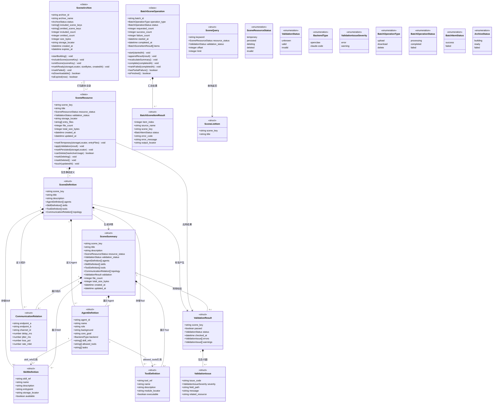

# 剧本管理数据模型

> 状态：设计阶段。本文只定义剧本管理领域中的静态剧本数据和管理过程数据。仿真运行状态、运行配置、运行引用、轮次和实验产物属于仿真编排领域，不在本文建模。

## 1. 模型边界

- **类**：具有独立标识、生命周期或业务行为，类图中同时列出字段和领域函数；
- **结构体**：只承载定义、请求或结果数据，不定义有副作用的业务函数；
- **枚举**：表达有限且稳定的状态和值域；
- 当前阶段采用文件目录扫描和按需解析，不引入数据库表；
- 剧本资源固定以目录形式存储，不定义资源格式字段或 `SceneResourceFormat` 枚举；
- 一个剧本目录对应一个 `scene_key`，目录内包含剧本定义文件、Skill 资源和 Tool 注册资源；
- `storage_locator`、`module_locator` 等定位信息只供内部模块使用，不向 Web 前端暴露物理路径；
- 剧本列表不提供可配置排序，固定按照剧本加入平台的先后顺序输出；
- 剧本列表只显示剧本名称，列表项不承载 Agent、Skill、Tool、拓扑、校验或文件统计信息；
- `SceneSummary` 用于展示单个剧本的完整静态详情；
- 不定义 `ScenePreview`，也不得创建与 `SceneSummary` 重复的详情展示模型；
- Skill 与 Tool 在 `SceneDefinition` 中分别存储和校验；
- `SceneDefinition` 和 `SceneSummary` 不包含仿真轮数、终止阈值、随机种子、运行模式、当前轮次或仿真状态；
- 删除剧本前调用仿真管理模块的占用查询接口，但占用状态及运行引用模型由仿真领域定义，不纳入剧本管理数据模型。

固定目录形式示例：

```text
scenes/<scene_key>/
├── meta_and_roles.json
├── instances_and_skills.json
├── network_topology.json
├── skills/
└── tools.py 或其他 Tool 注册资源
```

目录是剧本存储合同，不是可切换格式。若未来需要 ZIP、对象存储包或单文件剧本，必须重新设计上传、校验、定位和持久化合同，不得仅恢复一个格式枚举。

## 2. 模型添加顺序

1. SR-SCENE-01 上传剧本；
2. SR-SCENE-02 下载剧本；
3. SR-SCENE-03 删除剧本；
4. SR-SCENE-04 查看剧本详情；
5. SR-SCENE-05 查询剧本列表。

## 3. SR-SCENE-01 上传剧本模型

### 3.1 剧本资源类 `SceneResource`

| 字段 | 类型 | 必填 | 描述 |
|---|---|---:|---|
| `scene_key` | string | 是 | 剧本唯一标识，对应剧本目录名称。 |
| `title` | string | 是 | 剧本展示名称，缺失时回退为 `scene_key`。 |
| `resource_status` | `SceneResourceStatus` | 是 | 剧本资源生命周期状态。 |
| `validation_status` | `ValidationStatus` | 是 | 最近一次校验状态。 |
| `storage_locator` | string | 是 | 剧本目录的内部逻辑定位信息。 |
| `entry_files` | string[] | 是 | 剧本目录内的主要定义资源列表。 |
| `file_count` | integer | 否 | 剧本目录包含的文件数量。 |
| `total_size_bytes` | integer | 否 | 剧本目录资源总大小。 |
| `created_at` | datetime | 是 | 剧本加入平台的时间，也是列表固定输出顺序的依据。 |
| `updated_at` | datetime | 否 | 最近修改时间。 |

领域函数：

| 函数 | 返回类型 | 职责 |
|---|---|---|
| `markTemporary(storageLocator, entryFiles)` | void | 记录临时目录和入口资源，并进入 `temporary` 状态。 |
| `applyValidation(result)` | void | 应用校验结果并更新校验状态。 |
| `markPersisted(storageLocator)` | void | 正式持久化成功后进入 `persisted` 状态。 |
| `canDelete(hasActiveUsage)` | boolean | 根据仿真管理模块返回的占用布尔值判断是否允许物理删除。 |
| `markDeleting()` | void | 删除开始前进入 `deleting` 状态。 |
| `markDeleted()` | void | 物理删除完成后进入 `deleted` 状态。 |
| `touch(updatedAt)` | void | 更新最近修改时间。 |

约束：

- `SceneResource` 不保存 `format` 字段；
- `storage_locator` 必须定位一个剧本目录，而不是可选格式的资源包；
- `canDelete` 不读取或维护仿真运行数据，`hasActiveUsage` 必须来自 `IF-SIM-01`。

### 3.2 剧本定义结构体 `SceneDefinition`

`SceneDefinition` 只描述从剧本目录解析得到的静态内容。

| 字段 | 类型 | 必填 | 描述 |
|---|---|---:|---|
| `scene_key` | string | 是 | 剧本唯一标识。 |
| `title` | string | 是 | 剧本展示名称。 |
| `description` | string | 否 | 剧本背景、全局规则或说明。 |
| `agents` | `AgentDefinition[]` | 是 | Agent 定义集合。 |
| `skills` | `SkillDefinition[]` | 是 | 剧本中可被引用的 Skill 定义集合。 |
| `tools` | `ToolDefinition[]` | 是 | 剧本中可被授权的 Tool 定义集合。 |
| `topology` | `CommunicationRelation[]` | 是 | 剧本通信拓扑定义。 |

约束：

- `AgentDefinition.skill_refs` 只能引用 `skills` 中存在的 `skill_ref`；
- `AgentDefinition.allowed_tools` 只能引用 `tools` 中存在的 `tool_ref`；
- Skill 源文件读取权限与 Tool 执行权限分别校验；
- 不得增加资源格式、仿真轮数、终止阈值、随机种子、运行模式、当前轮次或仿真状态字段。

### 3.3 Agent 定义结构体 `AgentDefinition`

| 字段 | 类型 | 必填 | 描述 |
|---|---|---:|---|
| `agent_id` | string | 是 | 剧本内唯一 Agent 标识。 |
| `name` | string | 是 | Agent 展示名称。 |
| `role` | string | 是 | Agent 身份或角色。 |
| `background` | string | 否 | Agent 背景说明。 |
| `core_goal` | string | 否 | Agent 核心目标。 |
| `backend` | `BackendType` | 是 | Agent 后端类型。 |
| `skill_refs` | string[] | 是 | 引用 `SceneDefinition.skills`。 |
| `allowed_tools` | string[] | 是 | 引用 `SceneDefinition.tools`。 |
| `tasks` | string[] | 是 | Agent 初始任务定义。 |

### 3.4 Skill 定义结构体 `SkillDefinition`

| 字段 | 类型 | 必填 | 描述 |
|---|---|---:|---|
| `skill_ref` | string | 是 | 剧本内唯一 Skill 标识，也是 Agent 引用值。 |
| `name` | string | 否 | Skill 展示名称。 |
| `description` | string | 否 | Skill 功能说明。 |
| `entrypoint` | string | 是 | Skill 入口资源，例如包内 `SKILL.md`。 |
| `storage_locator` | string | 是 | Skill 在剧本目录内的逻辑定位信息。 |
| `available` | boolean | 是 | 入口及关联资源是否可读取。 |

### 3.5 Tool 定义结构体 `ToolDefinition`

| 字段 | 类型 | 必填 | 描述 |
|---|---|---:|---|
| `tool_ref` | string | 是 | 剧本内唯一 Tool 标识，也是 Agent 授权引用值。 |
| `name` | string | 否 | Tool 展示名称。 |
| `description` | string | 否 | Tool 功能说明。 |
| `module_locator` | string | 是 | Tool 注册模块在剧本目录内的逻辑定位信息。 |
| `executable` | boolean | 是 | Tool 是否成功注册并可执行。 |

### 3.6 通信关系结构体 `CommunicationRelation`

| 字段 | 类型 | 必填 | 描述 |
|---|---|---:|---|
| `endpoint_a` | string | 是 | 通信关系一端的 Agent 标识。 |
| `endpoint_b` | string | 是 | 通信关系另一端的 Agent 标识。 |
| `channel_id` | string | 是 | 剧本内唯一通道标识。 |
| `delay_ms` | number | 是 | 固定时延，单位毫秒。 |
| `jitter_ms` | number | 是 | 网络抖动，单位毫秒。 |
| `loss_pct` | number | 是 | 丢包率百分比。 |
| `rate_mbit` | number | 是 | 带宽上限，`0` 表示不限制。 |

网络参数是静态剧本中定义的通信环境，不等同于仿真实例的运行状态。

### 3.7 校验结果结构体 `ValidationResult`

| 字段 | 类型 | 必填 | 描述 |
|---|---|---:|---|
| `scene_key` | string | 否 | 能识别剧本标识时填写。 |
| `passed` | boolean | 是 | 是否通过校验。 |
| `status` | `ValidationStatus` | 是 | 校验状态。 |
| `checked_at` | datetime | 是 | 校验完成时间。 |
| `errors` | `ValidationIssue[]` | 是 | 阻止持久化或详情展示的错误。 |
| `warnings` | `ValidationIssue[]` | 是 | 不阻止处理但需要展示的问题。 |

### 3.8 校验问题结构体 `ValidationIssue`

| 字段 | 类型 | 必填 | 描述 |
|---|---|---:|---|
| `issue_code` | string | 是 | 稳定的问题分类编码。 |
| `severity` | `ValidationIssueSeverity` | 是 | 错误或警告。 |
| `field_path` | string | 否 | 对应逻辑字段路径。 |
| `message` | string | 是 | 问题说明。 |
| `related_resource` | string | 否 | 相关 Agent、Skill、Tool、文件或通道标识。 |

剧本校验只校验目录结构和静态剧本内容，不校验仿真运行配置或状态。

### 3.9 批量处理任务类 `BatchSceneOperation`

| 字段 | 类型 | 必填 | 描述 |
|---|---|---:|---|
| `batch_id` | string | 是 | 批量任务唯一标识。 |
| `operation_type` | `BatchOperationType` | 是 | 上传、下载或删除。 |
| `status` | `BatchOperationStatus` | 是 | 批量任务整体状态。 |
| `requested_count` | integer | 是 | 请求项总数。 |
| `success_count` | integer | 是 | 成功项数量。 |
| `failure_count` | integer | 是 | 失败项数量。 |
| `started_at` | datetime | 是 | 开始处理时间。 |
| `completed_at` | datetime | 否 | 完成时间。 |
| `items` | `BatchSceneItemResult[]` | 是 | 每个剧本的独立处理结果。 |

领域函数：

- `start(startedAt)`；
- `appendResult(result)`；
- `recalculateSummary()`；
- `complete(completedAt)`；
- `markFailed(completedAt)`；
- `hasPartialFailure()`；
- `isFinished()`。

### 3.10 批量项结果结构体 `BatchSceneItemResult`

| 字段 | 类型 | 必填 | 描述 |
|---|---|---:|---|
| `item_index` | integer | 是 | 原始请求中的顺序。 |
| `source_name` | string | 否 | 上传时的原始目录名称。 |
| `scene_key` | string | 否 | 已识别或请求指定的剧本标识。 |
| `status` | `BatchItemStatus` | 是 | 成功或失败。 |
| `error_code` | string | 否 | 失败分类编码，例如 `SCENE_IN_USE`。 |
| `error_message` | string | 否 | 失败说明。 |
| `output_locator` | string | 否 | 成功结果的受控逻辑定位信息。 |

## 4. SR-SCENE-02 下载剧本模型

### 4.1 归档资源类 `SceneArchive`

`SceneArchive` 是下载阶段产生的临时输出，不改变剧本在平台内固定使用目录存储的事实。

| 字段 | 类型 | 必填 | 描述 |
|---|---|---:|---|
| `archive_id` | string | 是 | 归档资源唯一标识。 |
| `archive_name` | string | 是 | 用户下载时看到的归档名称。 |
| `status` | `ArchiveStatus` | 是 | 归档构建状态。 |
| `included_scene_keys` | string[] | 是 | 已加入归档的剧本标识。 |
| `omitted_scene_keys` | string[] | 是 | 未加入归档的剧本标识。 |
| `included_count` | integer | 是 | 归档中的剧本数量。 |
| `omitted_count` | integer | 是 | 未归档的剧本数量。 |
| `size_bytes` | integer | 否 | 归档资源大小。 |
| `storage_locator` | string | 否 | 临时归档资源内部定位信息。 |
| `created_at` | datetime | 否 | 归档生成时间。 |
| `expires_at` | datetime | 否 | 临时归档清理时间。 |

领域函数：

- `startBuilding()`；
- `includeScene(sceneKey)`；
- `omitScene(sceneKey)`；
- `markReady(storageLocator, sizeBytes, createdAt)`；
- `markFailed()`；
- `isDownloadable()`；
- `isExpired(now)`。

## 5. SR-SCENE-03 删除剧本模型

删除剧本不新增仿真运行数据模型。剧本管理流程只执行以下步骤：

1. 以 `scene_key` 调用 `IF-SIM-01 查询剧本占用状态`；
2. 仿真管理模块返回是否存在活动占用；
3. 存在占用时，生成失败的 `BatchSceneItemResult`，错误码为 `SCENE_IN_USE`；
4. 不存在占用时，删除对应剧本目录。

占用状态、仿真实例和运行引用的字段定义统一放在《仿真编排与容器运行时设计》中。

## 6. SR-SCENE-04 剧本详情模型

### 6.1 剧本详情结构体 `SceneSummary`

| 字段 | 类型 | 必填 | 描述 |
|---|---|---:|---|
| `scene_key` | string | 是 | 剧本唯一标识。 |
| `title` | string | 是 | 剧本展示名称。 |
| `description` | string | 否 | 剧本说明。 |
| `resource_status` | `SceneResourceStatus` | 是 | 当前资源状态。 |
| `validation_status` | `ValidationStatus` | 是 | 最近校验状态。 |
| `agents` | `AgentDefinition[]` | 是 | Agent 详细信息。 |
| `skills` | `SkillDefinition[]` | 是 | Skill 定义列表。 |
| `tools` | `ToolDefinition[]` | 是 | Tool 定义列表。 |
| `topology` | `CommunicationRelation[]` | 是 | 通信拓扑。 |
| `validation` | `ValidationResult` | 否 | 最近或本次只读解析附带的校验结果。 |
| `file_count` | integer | 否 | 剧本目录文件数量。 |
| `total_size_bytes` | integer | 否 | 剧本目录资源总大小。 |
| `created_at` | datetime | 是 | 剧本加入平台的时间。 |
| `updated_at` | datetime | 否 | 最近修改时间。 |

约束：

- `SceneSummary` 不包含 `format`；
- 详情接口只读，不得启动仿真或修改运行状态；
- 不再定义 `ScenePreview`。

## 7. SR-SCENE-05 剧本列表模型

### 7.1 剧本查询条件结构体 `SceneQuery`

| 字段 | 类型 | 必填 | 描述 |
|---|---|---:|---|
| `keyword` | string | 否 | 按剧本标识或标题过滤。 |
| `resource_status` | `SceneResourceStatus` | 否 | 按资源状态过滤。 |
| `validation_status` | `ValidationStatus` | 否 | 按校验状态过滤。 |
| `offset` | integer | 否 | 起始位置。 |
| `limit` | integer | 否 | 最大返回数量。 |

查询不提供排序参数，固定按照 `SceneResource.created_at` 从早到晚输出。

### 7.2 剧本列表项结构体 `SceneListItem`

| 字段 | 类型 | 必填 | 描述 |
|---|---|---:|---|
| `scene_key` | string | 是 | 用于查看详情、下载和删除时定位剧本。 |
| `title` | string | 是 | 前端列表唯一显示的业务字段。 |

## 8. 枚举

### 8.1 `SceneResourceStatus`

- `temporary`
- `persisted`
- `deleting`
- `deleted`
- `invalid`

### 8.2 `ValidationStatus`

- `unknown`
- `valid`
- `invalid`

### 8.3 `BackendType`

- `openclaw`
- `claude-code`

### 8.4 `ValidationIssueSeverity`

- `error`
- `warning`

### 8.5 `BatchOperationType`

- `upload`
- `download`
- `delete`

### 8.6 `BatchOperationStatus`

- `processing`
- `completed`
- `failed`

### 8.7 `BatchItemStatus`

- `success`
- `failed`

### 8.8 `ArchiveStatus`

- `building`
- `ready`
- `failed`

## 9. Mermaid 数据模型类图



## 10. 实现约束与当前差距

- 上传输入最终必须形成一个合法剧本目录；
- 持久化后一个 `scene_key` 对应一个目录；
- 下载归档只是传输输出，不是平台内部新增的剧本存储格式；
- 不得在 API、领域模型或前端模型中恢复 `format` 或 `SceneResourceFormat`；
- 当前代码中的 `SceneDefinition` 仍只直接保存 Agent 和拓扑，后续实现应构造独立的 `skills` 和 `tools` 定义集合；
- 当前查询接口返回的信息多于仅显示名称的目标列表合同，详情接口尚未统一使用 `SceneSummary`；
- 当前剧本加载流程还会修改全局仿真状态，该行为应迁移到仿真创建和启动流程。
