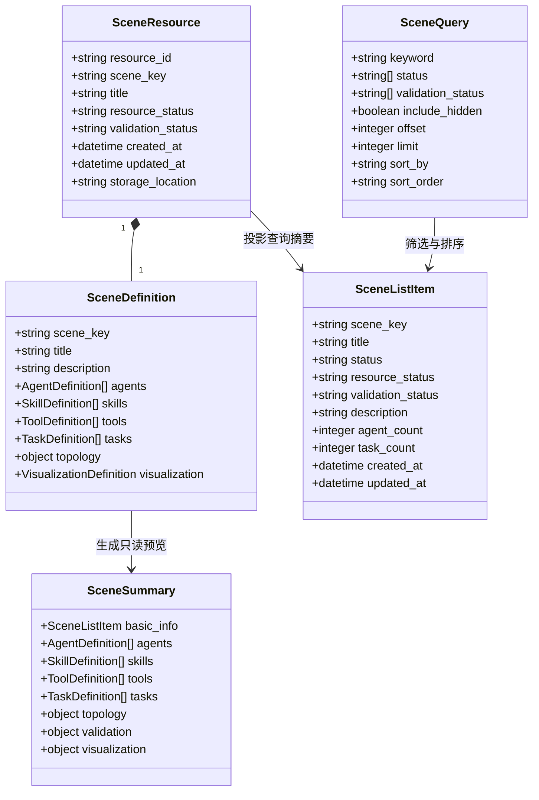
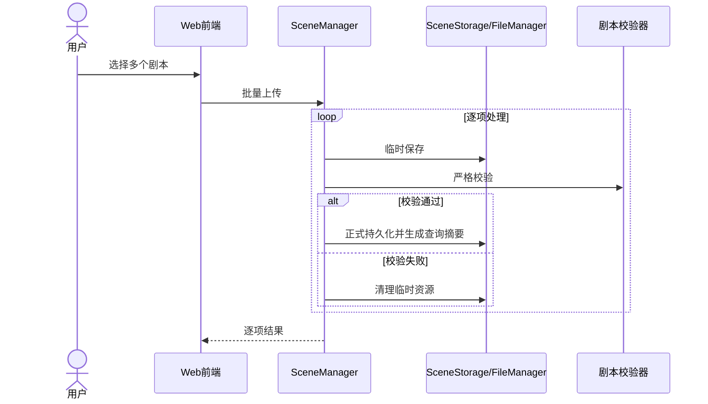
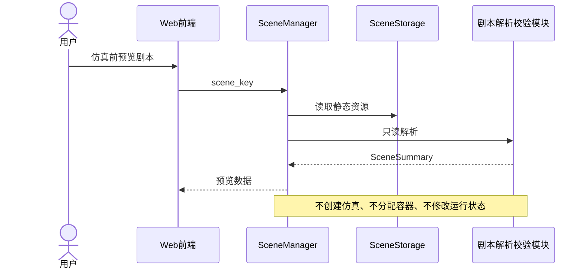
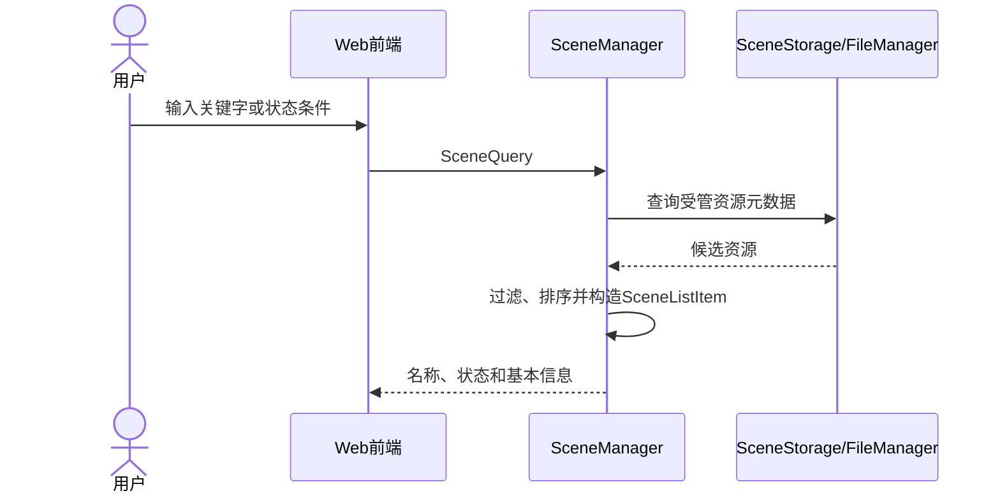

# 剧本管理设计

> 状态：目标设计与当前实现映射。本文定义剧本上传、下载、删除、预览和查询的需求边界、模块职责、接口、数据模型和迁移要求。SR 权威基线见 [系统需求规格.md](系统需求规格.md)。

## 1. 设计范围

剧本管理负责已经编辑完成、能够通过平台校验并用于仿真运行的静态剧本资源。

| SR-ID | SR名称 | SR描述 |
|---|---|---|
| SR-SCENE-01 | 剧本管理：上传剧本 | 平台支持批量上传已经编辑好的可以运行的剧本。 |
| SR-SCENE-02 | 剧本管理：下载剧本 | 平台支持批量下载平台上保存的剧本。 |
| SR-SCENE-03 | 剧本管理：删除剧本 | 平台支持批量删除平台上保存的剧本。 |
| SR-SCENE-04 | 剧本管理：预览剧本 | 平台支持在仿真开始前预览剧本信息。 |
| SR-SCENE-05 | 剧本管理：查询剧本 | 平台支持查询已保存的剧本，并展示剧本名称、状态及基本信息。 |

产品术语与技术模型映射：

- “预览剧本”是仿真开始前的只读详情查看能力；
- 技术实现可以继续使用 `SceneSummary`，不要求新增 `ScenePreview` 类型；
- “查询剧本”包含查询条件与结构化结果，不再等同于无条件返回名称列表；
- 查询结果至少包含剧本标识、名称、状态和基本信息。

## 2. 领域边界

`SceneDefinition` 只描述静态剧本内容：

- 基本信息；
- Agent 定义；
- Skill 定义；
- Tool 定义；
- Task 定义；
- Agent 对 Skill 和 Tool 的引用；
- 通信拓扑及网络参数；
- 可选的声明式可视化面板定义。

以下内容属于仿真编排领域，不写入静态剧本定义：

- 仿真实例和运行状态；
- 持续时间、执行超时、空闲超时；
- CPU、内存、进程数和并行 Agent 限制；
- 随机种子和运行模式；
- 容器分配、日志会话、PCAP、manifest 和终止原因。

剧本删除需要调用仿真管理模块确认是否存在活动占用，但剧本管理不复制仿真运行数据模型。

## 3. 当前实施状态

当前代码已经具备：

- 批量上传、逐项结果、严格校验和失败清理；
- 批量下载与归档；
- 批量删除与活动占用保护；
- 单个剧本只读详情；
- 按持久化资源发现剧本；
- 独立 Skill、Tool 和 Task 定义集合。

当前差距：

- 现有列表实现主要返回无条件名称项；
- 尚未完整实现按名称关键字和状态查询；
- 查询结果尚需统一返回状态和基本信息；
- 相关 API、模型、测试和 Dashboard 需要按 `SR-SCENE-05` 迁移。

旧的“列表无查询参数、只展示名称、禁止状态和基本信息”合同已被 `SR-SCENE-05` 取代，不得恢复为目标设计。

## 4. 逻辑模块

| 模块 | 主要职责 | 关联SR |
|---|---|---|
| Web 前端模块 | 提交批量上传、下载、删除请求；发起预览和查询；展示状态、基本信息和逐项结果 | SR-SCENE-01～05 |
| 剧本管理模块 | 统一编排剧本管理流程；维护批量上下文；处理查询和预览；汇总成功项和失败项 | SR-SCENE-01～05 |
| 文件存储模块 | 临时保存、持久化、定位、读取、列出、删除和清理剧本目录 | SR-SCENE-01～05 |
| 剧本解析校验模块 | 解析静态剧本；构造 Agent、Skill、Tool、Task、拓扑与面板定义；执行严格校验 | SR-SCENE-01、04、05 |
| 文件归档模块 | 将多个可下载剧本组合为受管归档资源 | SR-SCENE-02 |
| 仿真管理模块 | 查询目标剧本是否存在活动占用 | SR-SCENE-03 |

设计约束：

1. 剧本管理模块只负责编排，不直接实现文件系统细节或仿真运行。
2. 文件存储模块不理解剧本业务内容。
3. Skill 与 Tool 分别解析、分别存储、分别校验。
4. 当前不强制引入独立元数据数据库；查询索引可以由受管资源元数据生成。
5. 剧本固定以目录形式持久化，不需要向用户暴露存储格式枚举。
6. 查询列表不得为每条记录重复执行完整运行时准备，但可以读取必要的受管元数据和轻量静态摘要。
7. 预览不得创建仿真实例、分配容器、启动抓包或修改全局状态。
8. 查询中的“状态”属于剧本资源和校验状态，不是当前仿真实例状态。

## 5. 业务接口

### 5.1 Web 前端接口

| 接口ID | 接口名称 | 关联SR | 主要输入 | 主要输出 |
|---|---|---|---|---|
| IF-SCENE-01 | 批量上传剧本 | SR-SCENE-01 | 多个剧本归档或目录资源 | 各剧本上传结果和失败原因 |
| IF-SCENE-02 | 查询剧本 | SR-SCENE-05 | `SceneQuery` | `SceneListItem[]` 或分页结果 |
| IF-SCENE-03 | 批量下载剧本 | SR-SCENE-02 | 多个剧本标识 | 归档资源和逐项结果 |
| IF-SCENE-04 | 批量删除剧本 | SR-SCENE-03 | 多个剧本标识 | 各剧本删除结果 |
| IF-SCENE-05 | 预览剧本 | SR-SCENE-04 | 剧本标识 | `SceneSummary` 或失败原因 |

建议 REST 映射：

```text
POST   /api/scenes/batch/upload
POST   /api/scenes/query
POST   /api/scenes/batch/download
POST   /api/scenes/batch/delete
GET    /api/scenes/{scene_key}/preview
```

如果沿用现有详情路径，也必须在产品和接口文档中明确该接口承担“预览剧本”能力。

### 5.2 内部接口

| 接口ID | 接口名称 | 关联SR | 主要职责 |
|---|---|---|---|
| IF-STORE-01 | 临时保存剧本 | SR-SCENE-01 | 保存待校验资源 |
| IF-STORE-02 | 持久化剧本 | SR-SCENE-01 | 将校验通过资源转入正式存储 |
| IF-STORE-03 | 定位剧本资源 | SR-SCENE-02～05 | 根据剧本标识定位受管资源 |
| IF-STORE-04 | 读取剧本资源 | SR-SCENE-02、04、05 | 读取定义文件、关联资源和轻量摘要 |
| IF-STORE-05 | 删除剧本资源 | SR-SCENE-03 | 删除指定剧本目录 |
| IF-STORE-06 | 清理临时数据 | SR-SCENE-01 | 清理失败产生的临时目录 |
| IF-STORE-07 | 查询剧本资源 | SR-SCENE-05 | 根据查询条件返回资源元数据集合 |
| IF-PARSER-01 | 校验剧本 | SR-SCENE-01 | 校验静态结构、Agent、Skill、Tool、Task、拓扑和面板定义 |
| IF-PARSER-02 | 解析剧本预览 | SR-SCENE-04 | 生成只读 `SceneSummary` |
| IF-PARSER-03 | 构造查询摘要 | SR-SCENE-05 | 生成状态和基本信息摘要 |
| IF-ARCHIVE-01 | 创建剧本归档 | SR-SCENE-02 | 将多个剧本目录组合为归档资源 |
| IF-SIM-01 | 查询剧本占用状态 | SR-SCENE-03 | 返回是否存在活动占用 |

所有批量接口必须明确输入所有权、资源生命周期、逐项失败语义和可观测事件。

## 6. 查询合同

### 6.1 `SceneQuery`

建议字段：

| 字段 | 类型 | 必填 | 描述 |
|---|---|---:|---|
| `keyword` | string | 否 | 按剧本名称、标识或描述进行不区分大小写的包含查询 |
| `status` | string[] | 否 | 按用户可见剧本状态筛选 |
| `validation_status` | string[] | 否 | 按校验结果筛选 |
| `include_hidden` | boolean | 否 | 是否包含隐藏剧本，默认 `false` |
| `offset` | integer | 否 | 可选分页起点 |
| `limit` | integer | 否 | 可选分页大小 |
| `sort_by` | string | 否 | `created_at`、`updated_at` 或 `title` |
| `sort_order` | string | 否 | `asc` 或 `desc` |

第一版至少实现 `keyword` 和 `status`；分页和可配置排序可以后续实现，但不能删除查询和状态展示能力。

### 6.2 `SceneListItem`

查询结果至少包含：

| 字段 | 描述 |
|---|---|
| `scene_key` | 稳定剧本标识 |
| `title` | 剧本名称 |
| `status` | 用户可见聚合状态 |
| `resource_status` | 资源存在、隐藏、不可读取等状态 |
| `validation_status` | 已通过、失败、未知等校验状态 |
| `description` | 剧本简介 |
| `agent_count` | Agent 数量 |
| `task_count` | 初始任务数量 |
| `created_at` | 加入平台时间 |
| `updated_at` | 最近更新时间 |

聚合状态不得伪造。无法确定时使用明确的 `unknown`，不能默认标记为可运行。

## 7. 预览合同

`SceneSummary` 至少展示：

- 剧本标识、名称和描述；
- 资源状态和校验状态；
- Agent、Skill、Tool、Task 摘要；
- 通信拓扑和网络参数；
- 声明式可视化面板摘要；
- 校验错误和警告；
- 是否满足仿真启动前置条件。

预览只读取静态资源。它不得：

- 创建或启动仿真；
- 写入持续时间或资源限制；
- 分配 Agent 容器；
- 启动网络仿真或抓包；
- 创建正式日志会话；
- 修改剧本可见性或校验结果。

## 8. 架构要求

| AR-ID | AR名称 | 关联SR | AR描述 |
|---|---|---|---|
| AR-COM-01 | 通用：批量文件操作 | SR-SCENE-01、02、03 | 一次提交并分别处理多个剧本资源。 |
| AR-COM-03 | 通用：文件持久化 | SR-SCENE-01～05 | 提供临时存储、正式持久化、定位、读取、查询和删除能力。 |
| AR-COM-04 | 通用：批量结果反馈 | SR-SCENE-01、02、03 | 分别返回每个剧本的成功或失败结果。 |
| AR-SCENE-01 | 剧本：合法性校验 | SR-SCENE-01 | 校验静态结构、引用、拓扑和面板定义。 |
| AR-SCENE-02 | 剧本：失败数据清理 | SR-SCENE-01 | 校验失败或处理异常时清理临时数据。 |
| AR-SCENE-03 | 剧本：归档下载 | SR-SCENE-02 | 将可用剧本打包为统一归档。 |
| AR-SCENE-04 | 剧本：删除保护 | SR-SCENE-03 | 活动仿真占用时不得物理删除。 |
| AR-SCENE-05 | 剧本：只读预览 | SR-SCENE-04 | 预览无仿真运行副作用。 |
| AR-SCENE-06 | 剧本：结构化查询 | SR-SCENE-05 | 支持查询条件并返回名称、状态和基本信息。 |
| AR-SCENE-07 | 剧本：Skill 与 Tool 分离 | SR-SCENE-01、04 | 分别保存和校验 Skill 与 Tool。 |
| AR-SCENE-08 | 剧本：运行数据隔离 | SR-SCENE-01～05 | 静态剧本模型不持有仿真实例配置和状态。 |
| AR-SCENE-09 | 剧本：固定目录存储 | SR-SCENE-01～05 | 内部以目录形式持久化，不向用户暴露无意义格式枚举。 |

## 9. 逻辑数据模型



## 10. 关键时序

### 10.1 批量上传



### 10.2 预览剧本



### 10.3 查询剧本



## 11. 失败语义

- 批量操作逐项处理，不因单项失败回滚成功项；
- 上传校验失败时清理对应临时资源；
- 下载允许部分项目未进入归档，并返回原因；
- 删除遇到活动占用时返回 `SCENE_IN_USE`；
- 预览不存在、不可读取或解析失败时返回明确错误；
- 查询失败不得返回伪造状态；
- 查询条件非法时返回稳定错误码；
- 查询和预览失败不得修改剧本资源或仿真状态。

## 12. 迁移顺序

1. 在现有资源元数据上补齐 `resource_status`、`validation_status`、描述、Agent/Task 数量和更新时间。
2. 新增 `SceneQuery` 与结构化 `SceneListItem`。
3. 将现有无条件名称列表迁移为查询接口的默认空条件行为。
4. 保留现有详情解析能力，并在 API 和前端统一命名为“预览剧本”。
5. 更新 Dashboard，使查询结果展示名称、状态和基本信息。
6. 更新批量下载和删除选择器，使其消费新的查询结果。
7. 增加查询、状态筛选、隐藏资源、无运行副作用预览和占用删除保护测试。
8. 删除任何把“只返回名称、禁止查询”继续当作目标合同的旧测试和文档。
