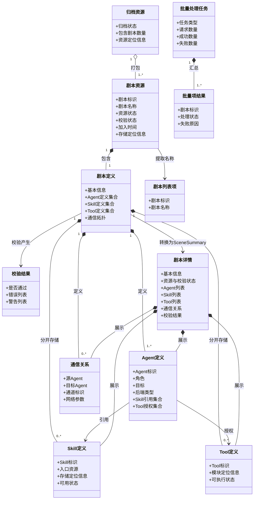
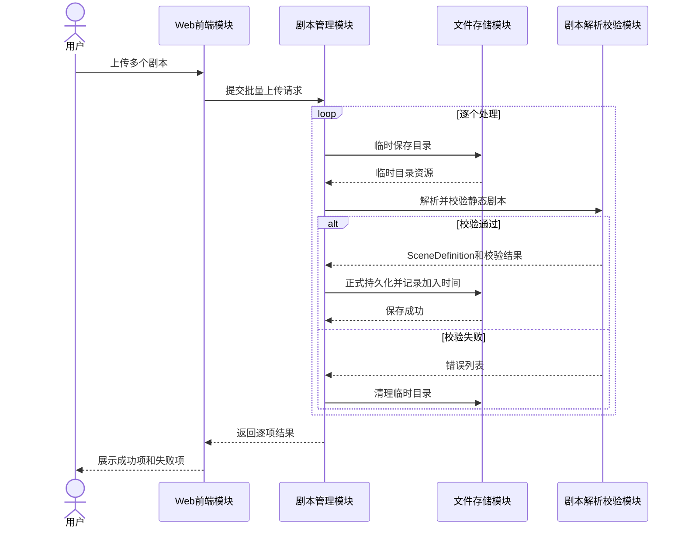
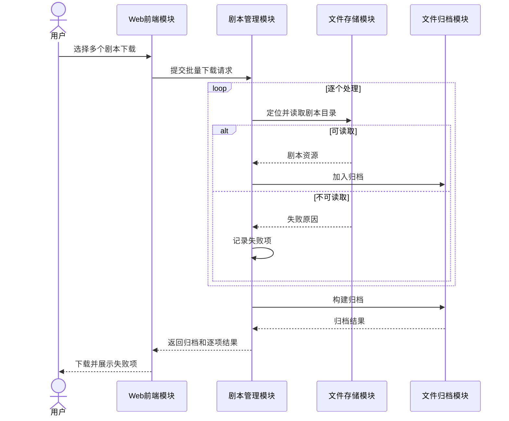
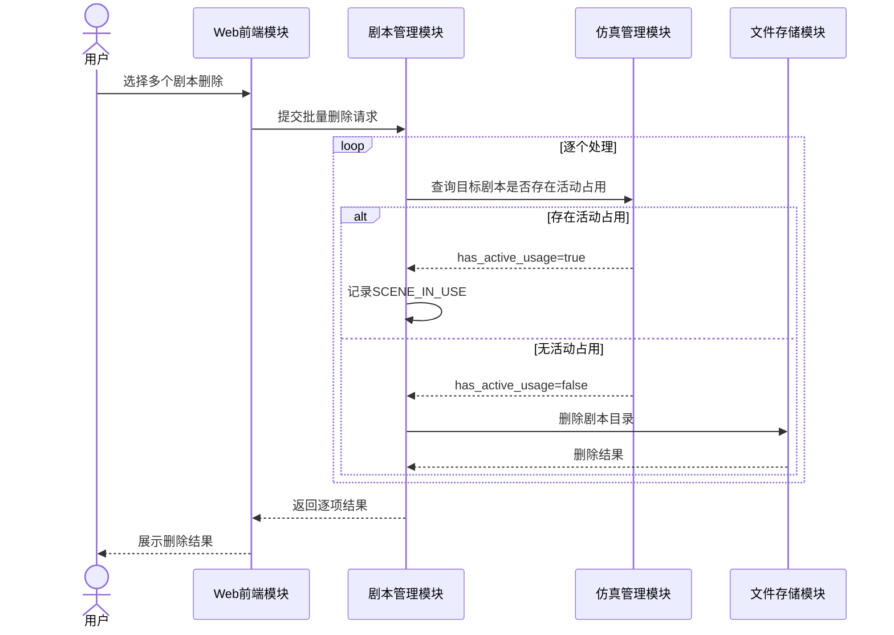
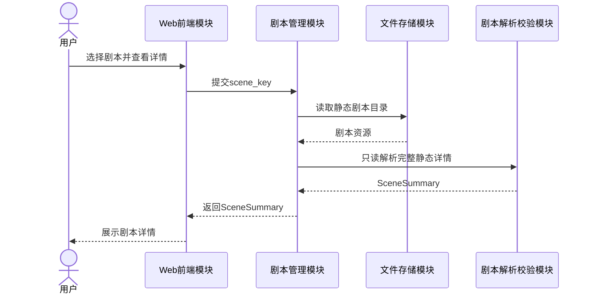
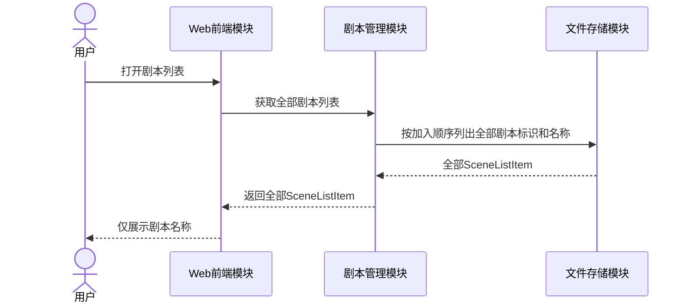

# 剧本管理设计

> 状态：设计阶段。本文记录剧本上传、列表、下载、删除和详情查看的需求边界、逻辑模块、接口、架构要求和交互流程。

## 1. 设计范围

剧本管理负责静态剧本资源进入平台后的完整管理流程。

| SR-ID | SR名称 | SR描述 |
|---|---|---|
| SR-SCENE-01 | 剧本管理：上传剧本 | 平台支持批量上传剧本，对每个剧本进行临时保存、合法性校验、正式持久化和失败清理。 |
| SR-SCENE-02 | 剧本管理：下载剧本 | 平台支持批量下载剧本，将可读取剧本归档，并分别返回缺失或读取失败项。 |
| SR-SCENE-03 | 剧本管理：删除剧本 | 平台支持批量删除剧本，并在物理删除前检查运行占用状态。 |
| SR-SCENE-04 | 剧本管理：查看剧本详情 | 平台支持在不启动仿真的情况下读取单个剧本的完整静态详情。 |
| SR-SCENE-05 | 剧本管理：获取剧本列表 | 平台打开列表时直接返回全部已保存剧本，并按照加入顺序只展示剧本名称。 |

列表与详情边界：

- 剧本列表只显示剧本名称；
- 列表接口无请求体、无查询参数，直接返回全部 `SceneListItem[]`；
- `scene_key` 仅用于详情、下载和删除定位，前端只渲染 `title`；
- 不提供搜索、状态过滤、分页或可配置排序；
- 列表固定按照剧本加入平台的先后顺序输出；
- 单个剧本详情统一返回 `SceneSummary`；
- 不定义或返回 `ScenePreview`；
- 列表和详情均不得读取、返回或修改仿真运行数据。

## 2. 领域边界

`SceneDefinition` 只描述静态剧本内容：

- 剧本基本信息；
- Agent 定义；
- Skill 定义；
- Tool 定义；
- Agent 对 Skill 和 Tool 的引用；
- 通信拓扑及网络参数。

以下内容属于仿真编排领域，不属于剧本管理：

- 仿真实例；
- 最大轮数和停滞终止阈值；
- 运行模式和随机种子；
- 当前轮次和仿真状态；
- 运行引用和剧本占用详情；
- 容器分配、日志会话、PCAP、manifest 和终止原因。

剧本删除需要调用仿真管理模块确认是否存在活动占用，但剧本管理不保存或复制仿真运行数据模型。

剧本固定以目录形式存储。目录是内部存储合同，不通过格式字段或枚举表达。

## 3. 当前代码基础与设计缺口

当前代码已具备：

- 从持久化目录发现可用剧本；
- 按剧本标识读取定义文件；
- 将剧本基本信息、Agent 引用和通信拓扑解析为内存对象；
- 在 Agent 运行期间按需读取 Skill 和场景 Tool 资源。

当前尚缺少完整的：

- 批量上传与逐项结果汇总；
- 临时存储、合法性校验、正式持久化和失败清理；
- 独立 Skill 定义集合和 Tool 定义集合；
- 批量下载与归档；
- 批量删除与占用保护；
- 无参数返回全部剧本名称的列表合同；
- 统一使用 `SceneSummary` 的单个剧本详情合同；
- 无运行副作用的列表和详情读取流程。

当前剧本加载器仍会读取轮数配置并修改全局仿真状态，这是待迁移实现，不属于目标剧本管理设计。

## 4. 逻辑模块

| 模块 | 主要职责 | 关联SR |
|---|---|---|
| Web前端模块 | 提交上传、下载、删除和详情请求；打开全部剧本名称列表；展示详情和处理结果 | SR-SCENE-01～05 |
| 剧本管理模块 | 编排剧本管理流程；维护批量任务上下文；汇总成功项和失败项 | SR-SCENE-01～05 |
| 文件存储模块 | 临时保存、持久化、定位、读取、列出、删除和清理剧本目录 | SR-SCENE-01～05 |
| 剧本解析校验模块 | 解析静态剧本；分别构造 Skill 和 Tool 定义；生成 `SceneSummary` 并校验引用和拓扑 | SR-SCENE-01、04 |
| 文件归档模块 | 将多个可下载剧本组合为归档资源 | SR-SCENE-02 |
| 仿真管理模块 | 对外提供“目标剧本是否存在活动占用”的查询能力 | SR-SCENE-03 |

设计约束：

- 剧本管理模块只负责编排，不直接实现文件解析、归档或仿真运行；
- 文件存储模块不理解剧本业务内容；
- 剧本解析与合法性校验属于同一逻辑模块；
- Skill 与 Tool 分别解析、分别存储、分别校验；
- 当前不引入独立元数据数据库；
- 剧本固定以目录形式存储，不定义 `format` 或 `SceneResourceFormat`；
- 固定加入顺序由 `SceneResource.created_at` 表达，不向用户提供排序参数；
- 列表接口不接收任何查询条件；
- 列表只构造全部 `SceneListItem[]`，不得为列表逐个解析完整详情；
- 单个详情统一构造 `SceneSummary`，不得再构造 `ScenePreview`；
- 剧本模块不得维护仿真运行配置、仿真实例、运行引用集合或运行状态；
- 删除保护只消费仿真管理模块的查询结果，不把仿真内部数据复制到剧本领域。

## 5. 模块接口

### 5.1 Web 前端调用的业务接口

| 接口ID | 接口名称 | 提供模块 | 调用模块 | 关联SR | 主要输入 | 主要输出 |
|---|---|---|---|---|---|---|
| IF-SCENE-01 | 批量上传剧本 | 剧本管理模块 | Web前端模块 | SR-SCENE-01 | 多个剧本目录资源 | 各剧本上传结果和失败原因 |
| IF-SCENE-02 | 获取剧本列表 | 剧本管理模块 | Web前端模块 | SR-SCENE-05 | 无 | 按加入顺序排列的全部 `SceneListItem[]` |
| IF-SCENE-03 | 批量下载剧本 | 剧本管理模块 | Web前端模块 | SR-SCENE-02 | 多个剧本标识 | 归档资源和逐项结果 |
| IF-SCENE-04 | 批量删除剧本 | 剧本管理模块 | Web前端模块 | SR-SCENE-03 | 多个剧本标识 | 各剧本删除结果 |
| IF-SCENE-05 | 查看剧本详情 | 剧本管理模块 | Web前端模块 | SR-SCENE-04 | 剧本标识 | `SceneSummary` 或失败原因 |

`IF-SCENE-02` 不接受 `keyword`、资源状态、校验状态、`offset`、`limit` 或排序字段。

### 5.2 内部接口

| 接口ID | 接口名称 | 提供模块 | 调用模块 | 关联SR | 主要职责 |
|---|---|---|---|---|---|
| IF-STORE-01 | 临时保存剧本 | 文件存储模块 | 剧本管理模块 | SR-SCENE-01 | 保存待校验目录资源 |
| IF-STORE-02 | 持久化剧本 | 文件存储模块 | 剧本管理模块 | SR-SCENE-01 | 将校验通过目录转入正式存储 |
| IF-STORE-03 | 定位剧本资源 | 文件存储模块 | 剧本管理模块 | SR-SCENE-02～04 | 根据剧本标识定位目录 |
| IF-STORE-04 | 读取剧本资源 | 文件存储模块 | 剧本管理模块、剧本解析校验模块 | SR-SCENE-02、04 | 读取剧本定义和关联资源 |
| IF-STORE-05 | 删除剧本资源 | 文件存储模块 | 剧本管理模块 | SR-SCENE-03 | 删除指定剧本目录 |
| IF-STORE-06 | 清理临时数据 | 文件存储模块 | 剧本管理模块 | SR-SCENE-01 | 清理失败产生的临时目录 |
| IF-STORE-07 | 列出全部剧本名称 | 文件存储模块 | 剧本管理模块 | SR-SCENE-05 | 扫描全部已保存剧本，按加入顺序返回标识和名称 |
| IF-PARSER-01 | 校验剧本 | 剧本解析校验模块 | 剧本管理模块 | SR-SCENE-01 | 校验静态结构、Agent、Skill、Tool 和拓扑 |
| IF-PARSER-02 | 解析剧本详情 | 剧本解析校验模块 | 剧本管理模块 | SR-SCENE-04 | 生成 `SceneDefinition`、校验结果和 `SceneSummary` |
| IF-ARCHIVE-01 | 创建剧本归档 | 文件归档模块 | 剧本管理模块 | SR-SCENE-02 | 将多个剧本目录组合为归档资源 |
| IF-SIM-01 | 查询剧本占用状态 | 仿真管理模块 | 剧本管理模块 | SR-SCENE-03 | 输入 `scene_key`，返回是否存在活动占用；运行详情由仿真域内部维护 |

所有接口必须明确输入所有权、资源生命周期、失败语义、批量项结果和可观测事件。

## 6. 架构要求

| AR-ID | AR名称 | 关联SR | AR描述 |
|---|---|---|---|
| AR-COM-01 | 通用：批量文件操作 | SR-SCENE-01、02、03 | 系统应一次提交并分别处理多个剧本资源。 |
| AR-COM-03 | 通用：文件持久化 | SR-SCENE-01、02、04、05 | 系统应提供临时存储、正式持久化、定位、读取和列出能力。 |
| AR-COM-04 | 通用：批量结果反馈 | SR-SCENE-01、02、03 | 系统应分别返回每个剧本的成功或失败结果。 |
| AR-SCENE-01 | 剧本：合法性校验 | SR-SCENE-01 | 系统应校验静态剧本结构、Agent、Skill、Tool、引用关系和通信拓扑。 |
| AR-SCENE-02 | 剧本：失败数据清理 | SR-SCENE-01 | 校验失败或处理异常时应清理对应临时数据。 |
| AR-SCENE-03 | 剧本：归档下载 | SR-SCENE-02 | 系统应将可用剧本打包为统一归档资源。 |
| AR-SCENE-04 | 剧本：资源删除 | SR-SCENE-03 | 系统应定位并删除指定剧本资源。 |
| AR-SCENE-05 | 剧本：删除保护 | SR-SCENE-03 | 仿真管理模块确认存在活动占用时不得物理删除剧本。 |
| AR-SCENE-06 | 剧本：结构化解析 | SR-SCENE-04 | 系统应解析基本信息、Agent、Skill、Tool、任务和通信关系并生成 `SceneSummary`。 |
| AR-SCENE-07 | 剧本：只读详情 | SR-SCENE-04 | 查看详情不得启动仿真、分配容器或修改仿真状态。 |
| AR-SCENE-08 | 剧本：详情异常反馈 | SR-SCENE-04 | 不存在、不可读取或解析失败时应返回明确原因。 |
| AR-SCENE-09 | 剧本：全量名称列表 | SR-SCENE-05 | 系统应在无查询条件下返回全部已保存剧本的名称项。 |
| AR-SCENE-10 | 剧本：Skill与Tool分离 | SR-SCENE-01、04 | `SceneDefinition` 应分别保存 Skill 和 Tool 定义集合。 |
| AR-SCENE-11 | 剧本：运行数据隔离 | SR-SCENE-01～05 | 剧本定义、列表、详情和管理过程不得包含或维护仿真运行数据模型。 |
| AR-SCENE-12 | 剧本：列表详情分离 | SR-SCENE-04、05 | 列表使用 `SceneListItem`，详情使用 `SceneSummary`，不得定义 `ScenePreview`。 |
| AR-SCENE-13 | 剧本：固定加入顺序 | SR-SCENE-05 | 列表固定按剧本加入平台的先后顺序输出，不提供用户可配置排序。 |
| AR-SCENE-14 | 剧本：无条件全量列表 | SR-SCENE-05 | 不定义 `SceneQuery`，列表接口不得提供搜索、过滤或分页能力。 |
| AR-SCENE-15 | 剧本：固定目录存储 | SR-SCENE-01～05 | 剧本在平台内部固定以目录形式存储，不定义资源格式字段或枚举。 |

## 7. 逻辑数据模型

该模型只包含剧本管理数据。仿真占用、运行引用、仿真实例和运行配置统一定义在《仿真编排与容器运行时设计》中。

## 8. 时序设计

### 8.1 批量上传

### 8.2 批量下载

### 8.3 批量删除

剧本管理只消费 `has_active_usage`，不接收或保存仿真实例、运行引用集合和运行状态详情。

### 8.4 查看剧本详情

### 8.5 获取剧本列表

列表调用不携带搜索、过滤、分页或排序参数，也不得为了显示名称而逐个解析 Agent、Skill、Tool 或拓扑详情。

## 9. 失败语义

- 批量操作逐项处理，不因单项失败回滚已成功项；
- 上传校验失败时清理对应临时资源；
- 下载允许部分剧本未进入归档，并返回省略原因；
- 删除遇到活动占用时返回 `SCENE_IN_USE`，不得物理删除；
- 详情不存在、不可读取或解析失败时返回明确错误；
- 列表读取失败时整体返回明确错误，不返回伪造或部分分页结果；
- 列表和详情失败不得修改剧本资源或仿真状态。

## 10. 实现顺序

1. 将剧本加载器改为无运行副作用的静态解析器；
2. 构造独立 `SkillDefinition[]` 和 `ToolDefinition[]`；
3. 删除 `SceneQuery` 及列表搜索、过滤、分页、排序参数；
4. 实现无参数、按加入顺序返回全部 `SceneListItem[]` 的名称列表；
5. 实现统一返回 `SceneSummary` 的详情接口；
6. 删除 `ScenePreview` 及相关生产、消费和测试代码；
7. 实现批量上传及失败清理；
8. 实现批量下载和归档；
9. 实现批量删除，并通过 `IF-SIM-01` 获取占用布尔值；
10. 补充日志、测试和文档映射。
