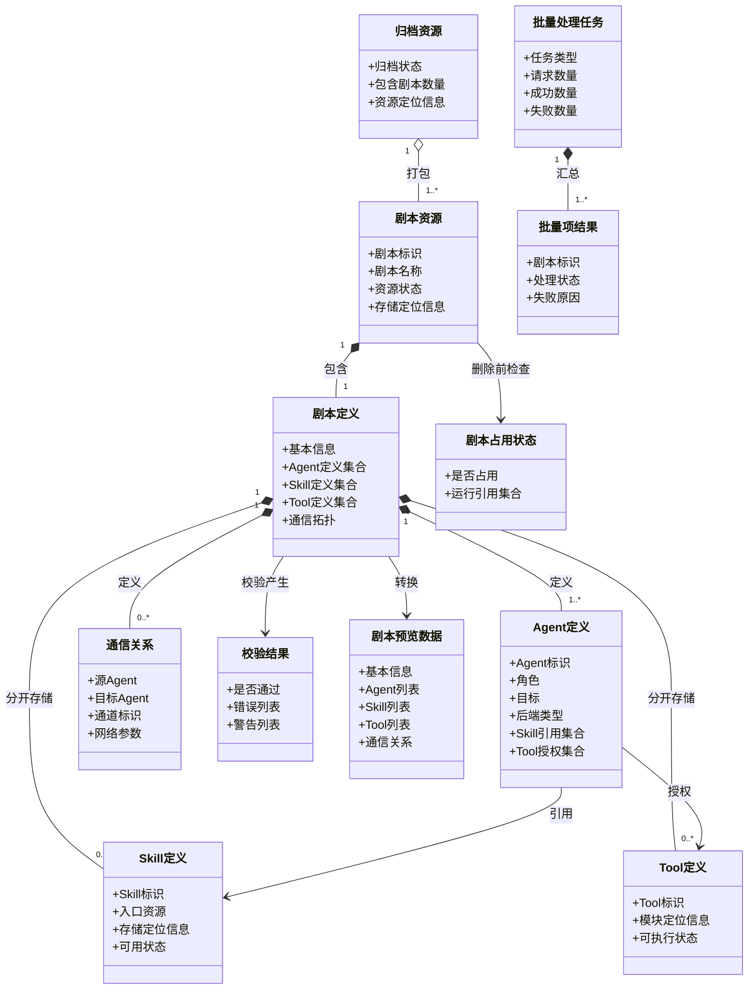
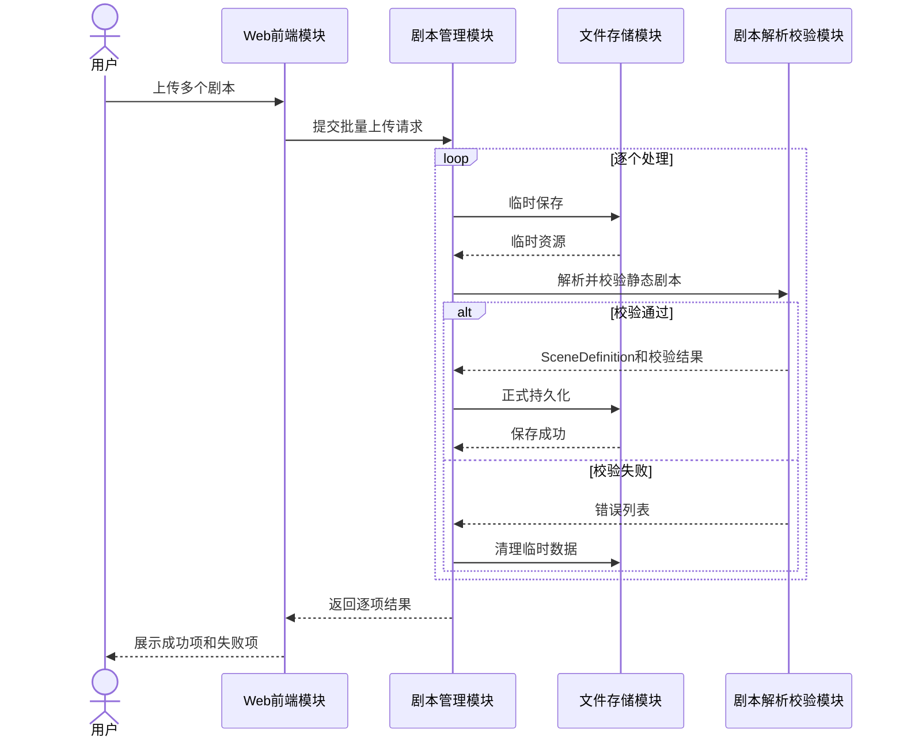
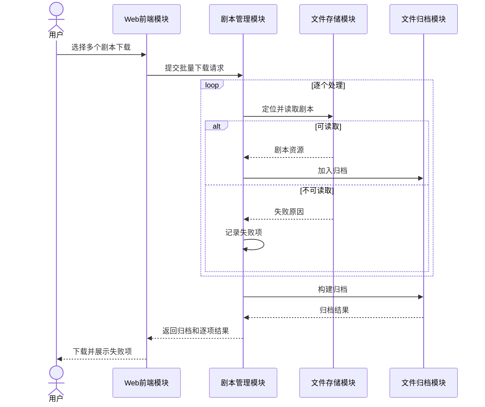
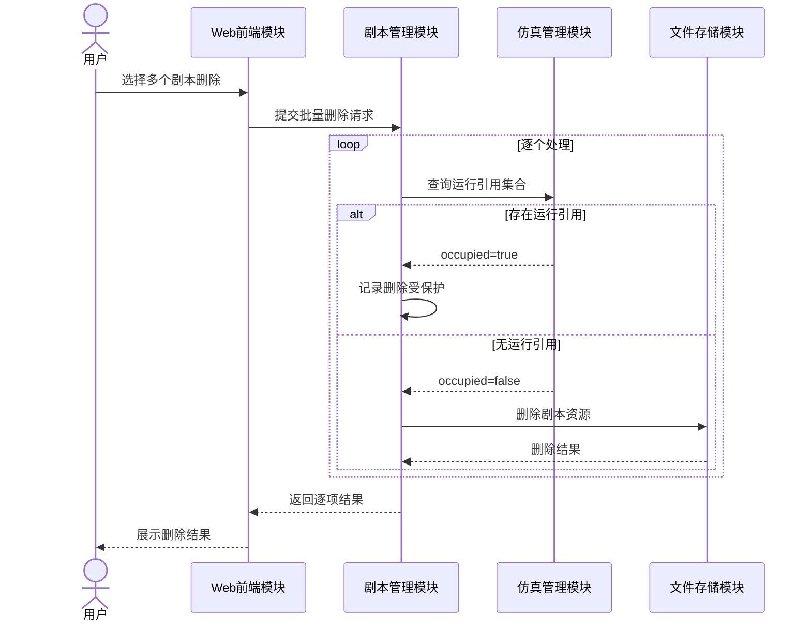
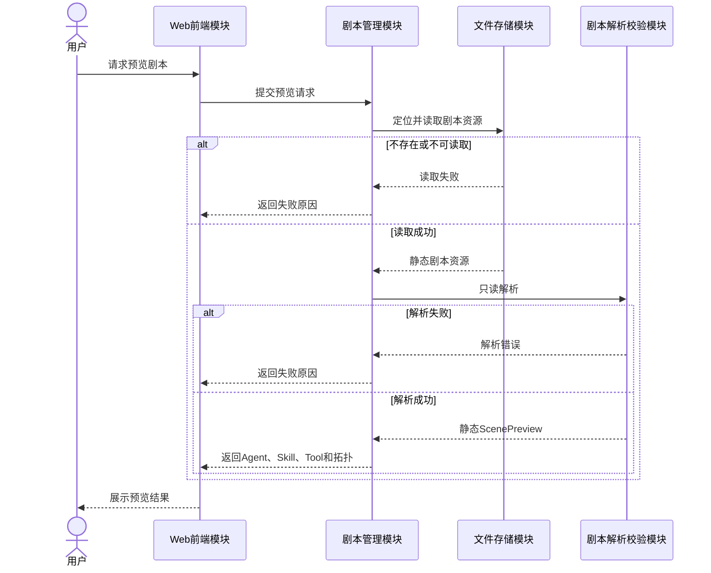
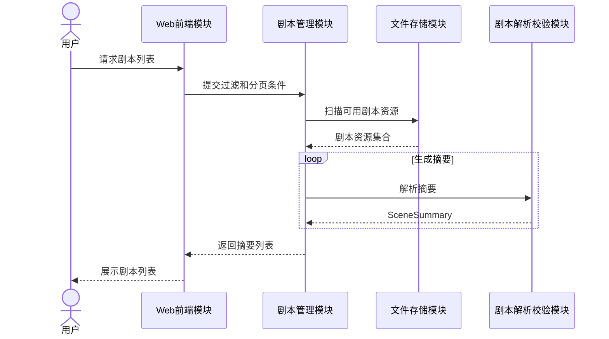

# 剧本管理设计

> 状态：设计阶段。本文记录剧本上传、查询、下载、删除和预览的需求边界、逻辑模块、接口、架构要求和交互流程。

## 1. 设计范围

剧本管理负责静态剧本资源进入平台后的完整管理流程。

| SR-ID | SR名称 | SR描述 |
|---|---|---|
| SR-SCENE-01 | 剧本管理：上传剧本 | 平台支持批量上传剧本，对每个剧本进行临时保存、合法性校验、正式持久化和失败清理。 |
| SR-SCENE-02 | 剧本管理：下载剧本 | 平台支持批量下载剧本，将可读取剧本归档，并分别返回缺失或读取失败项。 |
| SR-SCENE-03 | 剧本管理：删除剧本 | 平台支持批量删除剧本，并在物理删除前检查运行占用状态。 |
| SR-SCENE-04 | 剧本管理：预览剧本 | 平台支持在不启动仿真的情况下生成单个剧本的结构化只读预览。 |
| SR-SCENE-05 | 剧本管理：查询剧本 | 平台支持查询已保存剧本并返回摘要列表，供下载、删除和预览时选择目标。 |

查询与预览边界：

- 查询返回多个剧本的摘要列表；
- 预览返回一个剧本的详细静态结构；
- 查询不提供排序能力，只支持过滤和分页；
- 查询与预览均不得读取、返回或修改仿真运行配置。

## 2. 剧本与仿真边界

`SceneDefinition` 只描述静态剧本内容：

- 剧本基本信息；
- Agent 定义；
- Skill 定义；
- Tool 定义；
- Agent 对 Skill 和 Tool 的引用；
- 通信拓扑及网络参数。

以下内容属于仿真运行，不属于剧本管理：

- 最大轮数；
- 停滞终止阈值；
- 网络运行模式；
- 随机种子；
- 当前轮次；
- 仿真状态；
- 终止原因。

这些内容由仿真管理模块的 `SimulationRun` 和 `SimulationRuntimeConfig` 维护。

## 3. 当前代码基础与设计缺口

当前代码已具备：

- 从持久化目录发现可用剧本；
- 按剧本标识读取定义文件；
- 将剧本基本信息、Agent 引用和通信拓扑解析为内存对象；
- 在 Agent 运行期间按需读取 Skill 和场景 Tool 资源。

当前尚缺少完整的：

- 批量上传与逐项结果汇总；
- 临时存储、合法性校验、正式持久化和失败清理；
- 独立 Skill 定义集合和 Tool 定义集合；
- 批量下载与归档；
- 批量删除与占用保护；
- 无运行副作用的结构化预览；
- 统一查询摘要模型。

当前剧本加载器仍会读取剧本中的轮数配置并修改全局仿真状态，这是待迁移实现，不属于目标剧本管理设计。

## 4. 逻辑模块

| 模块 | 主要职责 | 关联SR |
|---|---|---|
| Web前端模块 | 提交上传、查询、下载、删除和预览请求；展示列表、预览和处理结果 | SR-SCENE-01～05 |
| 剧本管理模块 | 编排剧本管理流程；维护批量任务上下文；汇总成功项和失败项 | SR-SCENE-01～05 |
| 文件存储模块 | 临时保存、持久化、定位、读取、删除和清理剧本资源 | SR-SCENE-01～05 |
| 剧本解析校验模块 | 解析静态剧本；分别构造 Skill 和 Tool 定义；校验引用和拓扑 | SR-SCENE-01、04、05 |
| 文件归档模块 | 将多个可下载剧本组合为归档资源 | SR-SCENE-02 |
| 仿真管理模块 | 提供剧本运行占用引用，防止删除仍被仿真依赖的剧本 | SR-SCENE-03 |

设计约束：

- 剧本管理模块只负责编排，不直接实现文件解析、归档或仿真运行；
- 文件存储模块不理解剧本业务内容；
- 剧本解析与合法性校验属于同一逻辑模块；
- Skill 与 Tool 分别解析、分别存储、分别校验；
- 当前不引入独立元数据数据库，摘要可通过目录扫描和按需解析获得；
- 剧本模块不得维护 `SimulationRuntimeConfig`。

## 5. 模块接口

### 5.1 Web前端调用的业务接口

| 接口ID | 接口名称 | 提供模块 | 调用模块 | 关联SR | 主要输入 | 主要输出 |
|---|---|---|---|---|---|---|
| IF-SCENE-01 | 批量上传剧本 | 剧本管理模块 | Web前端模块 | SR-SCENE-01 | 多个剧本资源 | 各剧本上传结果和失败原因 |
| IF-SCENE-02 | 查询剧本列表 | 剧本管理模块 | Web前端模块 | SR-SCENE-05 | 查询条件 | 剧本摘要列表 |
| IF-SCENE-03 | 批量下载剧本 | 剧本管理模块 | Web前端模块 | SR-SCENE-02 | 多个剧本标识 | 归档资源和逐项结果 |
| IF-SCENE-04 | 批量删除剧本 | 剧本管理模块 | Web前端模块 | SR-SCENE-03 | 多个剧本标识 | 各剧本删除结果 |
| IF-SCENE-05 | 预览剧本 | 剧本管理模块 | Web前端模块 | SR-SCENE-04 | 剧本标识 | 静态结构化预览或失败原因 |

### 5.2 内部接口

| 接口ID | 接口名称 | 提供模块 | 调用模块 | 关联SR | 主要职责 |
|---|---|---|---|---|---|
| IF-STORE-01 | 临时保存剧本 | 文件存储模块 | 剧本管理模块 | SR-SCENE-01 | 保存待校验资源 |
| IF-STORE-02 | 持久化剧本 | 文件存储模块 | 剧本管理模块 | SR-SCENE-01 | 将校验通过资源转入正式存储 |
| IF-STORE-03 | 定位剧本资源 | 文件存储模块 | 剧本管理模块 | SR-SCENE-02～05 | 根据剧本标识定位资源 |
| IF-STORE-04 | 读取剧本资源 | 文件存储模块 | 剧本管理模块、剧本解析校验模块 | SR-SCENE-02、04、05 | 读取剧本定义和关联资源 |
| IF-STORE-05 | 删除剧本资源 | 文件存储模块 | 剧本管理模块 | SR-SCENE-03 | 删除指定剧本持久化资源 |
| IF-STORE-06 | 清理临时数据 | 文件存储模块 | 剧本管理模块 | SR-SCENE-01 | 清理失败产生的临时数据 |
| IF-PARSER-01 | 校验剧本 | 剧本解析校验模块 | 剧本管理模块 | SR-SCENE-01 | 校验静态结构、Agent、Skill、Tool 和拓扑 |
| IF-PARSER-02 | 解析剧本 | 剧本解析校验模块 | 剧本管理模块 | SR-SCENE-04、05 | 生成静态剧本模型、预览或摘要 |
| IF-ARCHIVE-01 | 创建剧本归档 | 文件归档模块 | 剧本管理模块 | SR-SCENE-02 | 将多个剧本组合为归档资源 |
| IF-SIM-01 | 查询剧本占用状态 | 仿真管理模块 | 剧本管理模块 | SR-SCENE-03 | 返回依赖目标剧本的运行引用集合 |

所有接口必须明确输入所有权、资源生命周期、失败语义、批量项结果和可观测事件。

## 6. 架构要求

| AR-ID | AR名称 | 关联SR | AR描述 |
|---|---|---|---|
| AR-COM-01 | 通用：批量文件操作 | SR-SCENE-01、02、03 | 系统应一次提交并分别处理多个剧本资源。 |
| AR-COM-03 | 通用：文件持久化 | SR-SCENE-01、02、04、05 | 系统应提供临时存储、正式持久化、定位和读取能力。 |
| AR-COM-04 | 通用：批量结果反馈 | SR-SCENE-01、02、03 | 系统应分别返回每个剧本的成功或失败结果。 |
| AR-SCENE-01 | 剧本：合法性校验 | SR-SCENE-01 | 系统应校验静态剧本结构、Agent、Skill、Tool、引用关系和通信拓扑。 |
| AR-SCENE-02 | 剧本：失败数据清理 | SR-SCENE-01 | 校验失败或处理异常时应清理对应临时数据。 |
| AR-SCENE-03 | 剧本：归档下载 | SR-SCENE-02 | 系统应将可用剧本打包为统一归档资源。 |
| AR-SCENE-04 | 剧本：资源删除 | SR-SCENE-03 | 系统应定位并删除指定剧本资源。 |
| AR-SCENE-05 | 剧本：删除保护 | SR-SCENE-03 | 存在仿真运行引用时不得物理删除剧本。 |
| AR-SCENE-06 | 剧本：结构化解析 | SR-SCENE-04、05 | 系统应解析基本信息、Agent、Skill、Tool、任务和通信关系。 |
| AR-SCENE-07 | 剧本：只读预览 | SR-SCENE-04 | 预览不得启动仿真、分配容器或修改仿真状态。 |
| AR-SCENE-08 | 剧本：预览异常反馈 | SR-SCENE-04 | 不存在、不可读取或解析失败时应返回明确原因。 |
| AR-SCENE-09 | 剧本：摘要查询 | SR-SCENE-05 | 系统应返回用于列表展示和目标选择的摘要。 |
| AR-SCENE-10 | 剧本：Skill与Tool分离 | SR-SCENE-01、04、05 | `SceneDefinition` 应分别保存 Skill 和 Tool 定义集合。 |
| AR-SCENE-11 | 剧本：运行配置隔离 | SR-SCENE-01、04、05 | 剧本定义、查询和预览不得包含或修改仿真运行配置。 |

## 7. 逻辑数据模型

该模型不包含 `SimulationRuntimeConfig`。仿真运行配置属于仿真编排领域。

## 8. 时序设计

### 8.1 批量上传

### 8.2 批量下载

### 8.3 批量删除

### 8.4 预览剧本

预览流程中不得读取或修改 `SimulationRuntimeConfig`。

### 8.5 查询剧本

## 9. 批量失败语义

- 批量上传、下载和删除均逐项处理；
- 单项失败不回滚已经成功的项目；
- 批量结果必须包含请求数量、成功数量、失败数量和逐项原因；
- `completed` 表示逐项处理完成，不表示全部成功；
- 请求本身无法解析或无法开始处理时，批量任务才进入 `failed`。

## 10. 可观测性

剧本管理行为写入 `application.jsonl`，至少记录：

- 操作类型；
- 批量任务标识；
- 剧本标识；
- 处理状态；
- 失败分类；
- 处理耗时；
- 是否因仿真占用被拒绝。

剧本管理不得向 `network.jsonl` 写入推测的网络事件。
