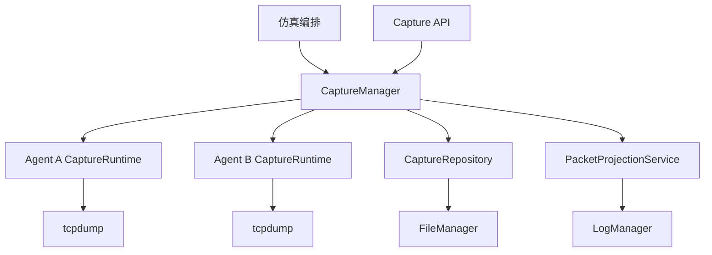
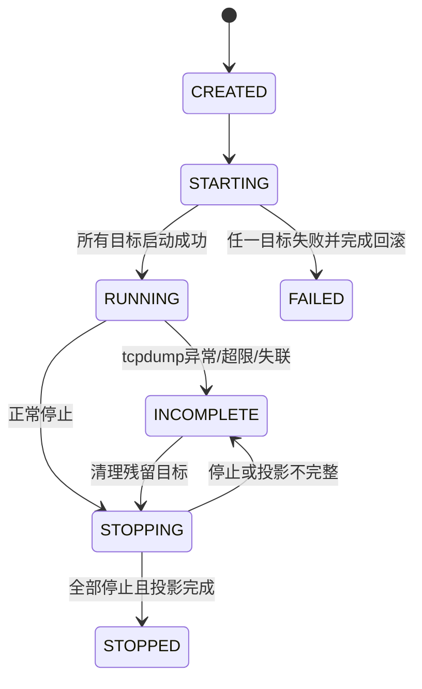

# 统一抓包模块设计

> 状态：已实现第一版。本文是抓包生命周期、PCAP 资源、数据包投影、分析、质量审计和下载入口的权威设计。

## 1. 目标

AgentNetwork 使用每个 Agent 容器网络命名空间内的真实 `tcpdump` 作为网络事实来源。统一抓包模块负责：

- 为一次仿真创建唯一抓包会话；
- 并发启动、检查和停止所有 Agent 的本地抓包；
- 任一 Agent 启动失败时回滚已启动目标；
- 将 PCAP、capture manifest 和抓包会话 manifest 注册到 `FileManager`；
- 在停止后把 PCAP 幂等投影为 `network.jsonl`；
- 提供数据包查询、统计、分析、审计、下载和 bundle 统一入口；
- 抓包不完整时禁止将实验报告为完整。

统一管理不表示把 `tcpdump` 移到控制面。`tcpdump` 必须继续运行在各 Agent 容器的网络命名空间中。

## 2. 模块结构

```text
agent_network/capture_management/
├── models.py          # CaptureSession、CaptureTarget、CaptureConfig、状态
├── repository.py      # 抓包领域资源索引，物理操作委托 FileManager
├── runtime.py         # Agent 容器内唯一 tcpdump 生命周期入口
├── manager.py         # 控制面统一抓包门面
├── coordinator.py     # 当前 Agent HTTP 传输适配与停止后投影
└── projection.py      # PCAP -> network.jsonl 幂等投影
```

活动外部 API 位于：

```text
agent_network/api/captures.py
```

## 3. 架构



## 4. 领域模型

### 4.1 CaptureSession

| 字段 | 描述 |
|---|---|
| `capture_id` | 抓包会话唯一标识；当前 Agent HTTP 传输中与 `session_id` 相同 |
| `simulation_id` | 所属仿真实例 |
| `session_id` | 日志和实验资源目录标识 |
| `trace_id` | 应用证据关联标识 |
| `config` | 抓包配置 |
| `expected_agents` | 应抓包的 Agent 集合 |
| `targets` | 每个 Agent 的抓包状态 |
| `state` | 会话状态 |
| `projection_state` | `network.jsonl` 投影状态 |
| `audit_state` | 质量审计状态 |
| `termination_reason` | 停止或失败原因 |

### 4.2 CaptureTarget

每个目标记录逻辑 Agent、容器身份、Runtime URL、运行 IP、接口、进程 ID、PCAP 资源、manifest 资源、捕获字节数、SHA-256 和错误信息。

### 4.3 CaptureConfig

当前字段：

- `interface`；
- `snap_length`；
- `max_bytes`；
- `include_control_plane`；
- `bpf_filter`；
- `health_check_interval_seconds`；
- `stop_timeout_seconds`；
- `hash_algorithm=sha256`；
- `projection_mode=finalize`。

第一版只允许停止后最终投影，不允许应用层生成或补造数据包。

## 5. 状态机



停止操作必须幂等。已停止会话重复停止时返回已有最终状态，不重复写入网络日志。

## 6. 启动与回滚

1. 控制面创建 `CaptureSession` 和受管会话目录；
2. 并发调用所有 Agent `/capture/start`；
3. Agent Runtime 启动 `tcpdump` 并注册 PCAP 与 manifest；
4. 所有目标均进入 `RUNNING` 后，仿真才可继续；
5. 任一目标失败时，控制面停止已经启动的目标并将会话标记为 `FAILED`；
6. 失败产生的 PCAP 和 manifest 保留用于排障。

## 7. 健康检查与终止

健康检查不依赖仿真轮次。仿真编排可以按时间间隔、事件完成回调或停止路径调用 `check_health`。

以下情况将抓包标记为 `INCOMPLETE`：

- `tcpdump` 异常退出；
- PCAP 超过最大字节数；
- Agent Runtime 失联；
- PCAP 缺失或没有完整全局头；
- manifest 写入失败；
- SHA-256 不一致；
- 最终网络日志投影失败。

## 8. PCAP 与 network.jsonl

PCAP 是原始网络事实，`network.jsonl` 是结构化投影。

停止后，`PacketProjectionService`：

1. 刷新所有 PCAP 的大小和 SHA-256；
2. 计算抓包会话源指纹；
3. 从 PCAP 解码数据包；
4. 生成符合 `network.v4` 的记录；
5. 调用 `LogManager.emit_network_event`；
6. 写入 `network.projection.json`；
7. 相同源指纹再次投影时直接返回，不重复写日志。

幂等日志标识由以下内容生成：

```text
capture_id + observer_agent_id + pcap_sha256 + packet_index
```

每条网络记录必须保留 `capture_id`、`packet_index`、`observer_agent_id` 和 `pcap_resource_id`。

## 9. 文件边界

`CaptureRepository` 只定义抓包资源定位规则。以下物理能力继续由 `FileManager` 负责：

- 路径安全；
- 文件和目录注册；
- 原子 manifest 写入；
- 外部 PCAP 刷新；
- SHA-256；
- 下载准备；
- 可见性和删除；
- ZIP 归档。

不得在抓包模块中新增第二套文件注册表或可见性元数据。

## 10. API

活动入口：

```text
POST /api/captures
POST /api/captures/{capture_id}/start
GET  /api/captures/{capture_id}
POST /api/captures/{capture_id}/stop
GET  /api/captures/{capture_id}/artifacts
GET  /api/captures/{capture_id}/packets
GET  /api/captures/{capture_id}/stats
GET  /api/captures/{capture_id}/analysis
GET  /api/captures/{capture_id}/quality
GET  /api/captures/{capture_id}/bundle
GET  /api/captures/{capture_id}/agents/{agent_id}/pcap
```

`/api/packets` 不再挂载到活动服务。外部接口不得返回宿主机或容器物理路径。

## 11. 当前实现映射

- `full_packet_capture.py` 仅是现有 Agent HTTP 路由的薄适配器，实际生命周期委托 `CaptureRuntime`；
- `managed_simulations.py` 用统一协调器替换旧 `_capture` 和 `_capture_health` 钩子；
- `services/server.py` 挂载 `/api/captures`，不再挂载 `/api/packets`；
- 现有 `real_packet_store.py` 暂时作为 PCAP 解码与分析实现，被 `CaptureManager` 和投影服务调用；
- 现有 `experiment_manifest.py` 暂时保留实验来源、审计和 bundle 语义。

后续重命名或拆分解码器时不得改变本设计中的统一入口和证据边界。

## 12. 验收标准

1. 控制面只有 `CaptureManager` 一个抓包生命周期入口；
2. Agent 容器只有 `CaptureRuntime` 一个 `tcpdump` 所有者；
3. 部分启动失败自动回滚；
4. 抓包健康检查与仿真轮次无关；
5. PCAP 是网络事实唯一来源；
6. `network.jsonl` 只由 PCAP 投影生成；
7. 投影可重复调用且不会重复写入；
8. PCAP、manifest、投影结果和 bundle 都是受管文件资源；
9. 抓包或投影不完整时实验不得报告完整；
10. 活动外部 API 统一位于 `/api/captures`。
