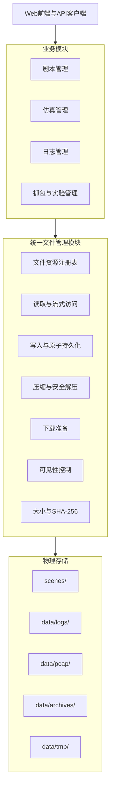

# 统一文件管理设计

> 状态：目标设计，第一阶段实现中。本文定义剧本、日志、PCAP、manifest、分析结果和归档文件共用的文件基础设施。业务语义仍由各自领域模块负责。

## 1. 设计目标

平台新增统一 `FileManager`，集中管理受管文件的：

- 写入、追加写入和原子持久化；
- 文本、二进制和流式读取；
- ZIP 压缩与安全解压；
- 下载资源准备；
- 显示、隐藏和列表过滤；
- 文件定位、大小、SHA-256 和生命周期元数据；
- 物理删除和失败清理。

统一管理不代表所有文件放入同一目录。剧本、日志、PCAP 和归档继续使用独立存储根目录，但业务模块不得自行拼接或向外暴露物理路径。

## 2. 模块边界

`FileManager` 负责文件基础设施，不负责业务语义。

| 模块 | 保留的业务职责 | 委托给 FileManager 的职责 |
|---|---|---|
| 剧本管理模块 | 剧本结构、Agent、Skill、Tool 和拓扑校验 | 临时保存、读取、解压、持久化、压缩、下载、可见性和删除 |
| `LogManager` | 日志 schema、规范化、内存索引和查询语义 | JSONL 写入、追加、文件列表、下载、可见性和物理删除 |
| 抓包模块 | `tcpdump` 生命周期、抓包健康状态 | PCAP 文件注册、哈希、读取、下载和删除 |
| `pcap_reader` | 协议解析和网络字段提取 | 获取受控只读文件流或内部定位符 |
| `experiment_manifest` | 实验来源、状态和质量语义 | manifest、quality 和 analysis 文件的原子读写与归档 |
| API 层 | 请求校验、授权和业务结果映射 | 不直接使用 `open`、`Path.unlink`、`ZipFile` 操作业务文件 |

`FileManager` 不得：

- 解析剧本业务内容；
- 定义或放宽日志 schema；
- 解析 PCAP 协议；
- 判断实验是否业务完整；
- 绕过上层权限规则；
- 将隐藏等同于删除。

## 3. 架构位置



## 4. 文件资源模型

### 4.1 `FileResource`

| 字段 | 类型 | 描述 |
|---|---|---|
| `resource_id` | string | 受管文件资源唯一标识 |
| `owner_type` | string | 资源所属业务类型，如 `scene`、`log_session`、`capture_session` |
| `owner_id` | string | 剧本标识、仿真标识或 session 标识 |
| `resource_type` | string | `application_log`、`pcap`、`archive` 等资源类型 |
| `root_name` | string | 受管存储根名称，不是物理路径 |
| `relative_path` | string | 相对于受管根的内部路径 |
| `logical_name` | string | 下载和归档中使用的逻辑文件名 |
| `media_type` | string | MIME 类型 |
| `visible` | boolean | 是否在默认列表和普通下载中可见 |
| `state` | string | `ready`、`deleted` 等生命周期状态 |
| `size_bytes` | integer | 当前文件或目录大小 |
| `sha256` | string | 文件 SHA-256；目录为空 |
| `created_at` | datetime | 注册时间 |
| `updated_at` | datetime | 最近变更时间 |
| `error_message` | string | 最近失败原因 |

### 4.2 `DownloadDescriptor`

下载准备结果包含资源标识、逻辑名称、媒体类型、大小、SHA-256 和仅供服务端使用的内部路径。外部 API 不得直接返回内部路径。

### 4.3 可见性和生命周期

可见性与生命周期必须独立：

- `visible + ready`：文件存在且默认展示；
- `hidden + ready`：文件存在但默认查询和普通下载不可见；
- `deleted`：文件已物理删除，不能通过显示操作恢复。

隐藏和显示不得修改文件内容、哈希和业务语义。

## 5. 核心接口

| 接口 | 职责 |
|---|---|
| `register_existing(...)` | 将现有文件或目录纳入统一管理 |
| `write_bytes(...)` / `write_text(...)` | 使用临时文件和原子替换写入 |
| `append_text(resource_id, text)` | 追加写入 JSONL 等文本文件并更新完整性元数据 |
| `read_bytes(...)` / `read_text(...)` | 读取受管文件 |
| `open_stream(resource_id)` | 为大文件和下载提供流式读取 |
| `list_resources(...)` | 按所有者、资源类型、可见性和生命周期查询 |
| `set_visibility(resource_ids, visible)` | 批量显示或隐藏 |
| `prepare_download(resource_id)` | 校验存在性和 SHA-256 后生成下载描述 |
| `create_archive(resource_ids, ...)` | 将多个受管文件或目录压缩为 ZIP |
| `extract_archive(...)` | 在限制条件下安全解压到受管临时目录 |
| `delete(resource_ids)` | 物理删除并将资源状态更新为 `deleted` |

## 6. 路径和写入规则

1. 所有资源必须位于已配置的受管根目录内。
2. `relative_path` 必须是相对路径，拒绝绝对路径和 `..`。
3. 解析后的路径不得逃逸受管根。
4. 普通文件写入先写入同目录临时文件，再使用 `os.replace` 原子替换。
5. 文件注册表同样使用临时文件和原子替换。
6. 业务 API 不得返回宿主机或容器中的物理路径。
7. 符号链接不得注册为受管资源，也不得通过解压创建。

## 7. 压缩与解压规则

### 7.1 压缩

- 归档条目使用 `logical_name`，不包含服务器物理路径；
- 同名条目不得静默覆盖；
- PCAP 使用 ZIP stored，其他普通文本允许 deflate；
- 生成归档后登记大小和 SHA-256；
- 批量下载先由业务模块确定资源集合，再交给 `FileManager` 归档。

### 7.2 解压

- 只允许解压到受管临时根；
- 拒绝绝对路径、`..`、路径逃逸和符号链接；
- 限制条目数量、单文件大小和总解压大小；
- 先解压到临时目录，全部成功后原子移动到目标目录；
- 任何失败都必须删除临时目录；
- 剧本业务校验通过后，才允许从临时目录进入正式剧本存储。

## 8. 下载规则

1. 下载前必须检查资源存在、状态为 `ready` 且满足可见性和上层权限条件。
2. 下载前重新计算 SHA-256；与注册值不一致时拒绝下载。
3. 大文件和 PCAP 必须使用流式响应。
4. 目录必须先归档，不能直接作为文件下载。
5. 临时导出和归档必须注册为受管资源，并由清理策略删除。

## 9. 存储根建议

```text
scenes/
  <scene_key>/

data/
  file_registry.json
  logs/<session_id>/
  pcap/<session_id>/
  archives/
  tmp/upload/
  tmp/extract/
  tmp/archive/
```

默认根名称建议为：`scenes`、`logs`、`pcap`、`archives`、`temp`。

## 10. 失败语义

统一异常至少包括：

- `ResourceNotFoundError`：资源注册信息不存在或物理文件缺失；
- `ResourceNotReadyError`：资源隐藏、已删除或状态不可读；
- `UnsafePathError`：路径逃逸、危险归档条目或符号链接；
- `ArchiveLimitError`：归档条目数、单文件或总大小超限；
- `FileManagerError`：注册表损坏、哈希不一致或其他基础设施错误。

批量业务操作必须逐项转换为成功、失败和失败原因，不能因单项失败丢失其他结果。

## 11. 迁移计划

### 第一阶段：基础设施

- 新增 `agent_network/file_management/`；
- 实现资源注册表、安全路径、原子写入、读取、归档、解压、下载、可见性和删除；
- 增加独立单元测试。

### 第二阶段：日志文件

- `LogManager` 保留日志 schema、规范化和内存索引；
- JSONL 文件写入、列表、下载、可见性和删除迁移到 `FileManager`；
- 删除 `.log_visibility.json` 独立机制，由统一注册表保存可见性。

### 第三阶段：剧本文件

- 上传归档进入 `temp` 根；
- 使用统一安全解压；
- 校验成功后持久化到 `scenes` 根；
- 下载、隐藏、显示和删除统一通过资源标识执行。

### 第四阶段：PCAP 和实验文件

- 抓包模块完成 PCAP 后调用 `register_existing`；
- manifest、quality、analysis 和 bundle 统一注册；
- `api/packets.py` 不再直接读取、打包或下载物理路径。

## 12. 当前实现状态

第一阶段已开始：新增统一文件管理核心、资源模型和单元测试。现有日志、剧本和 PCAP 代码尚未全部迁移，迁移期间不得新增新的直接文件操作路径。